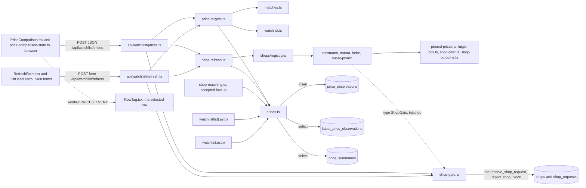
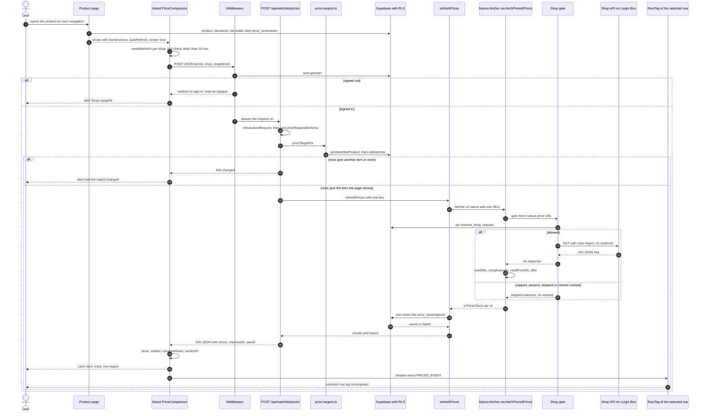
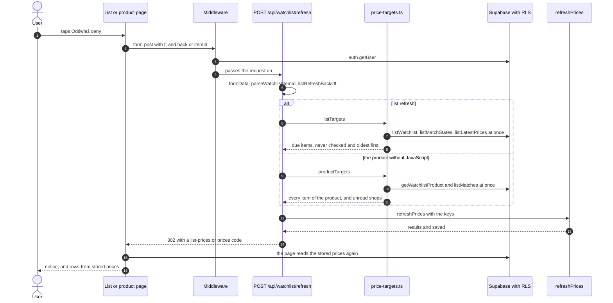
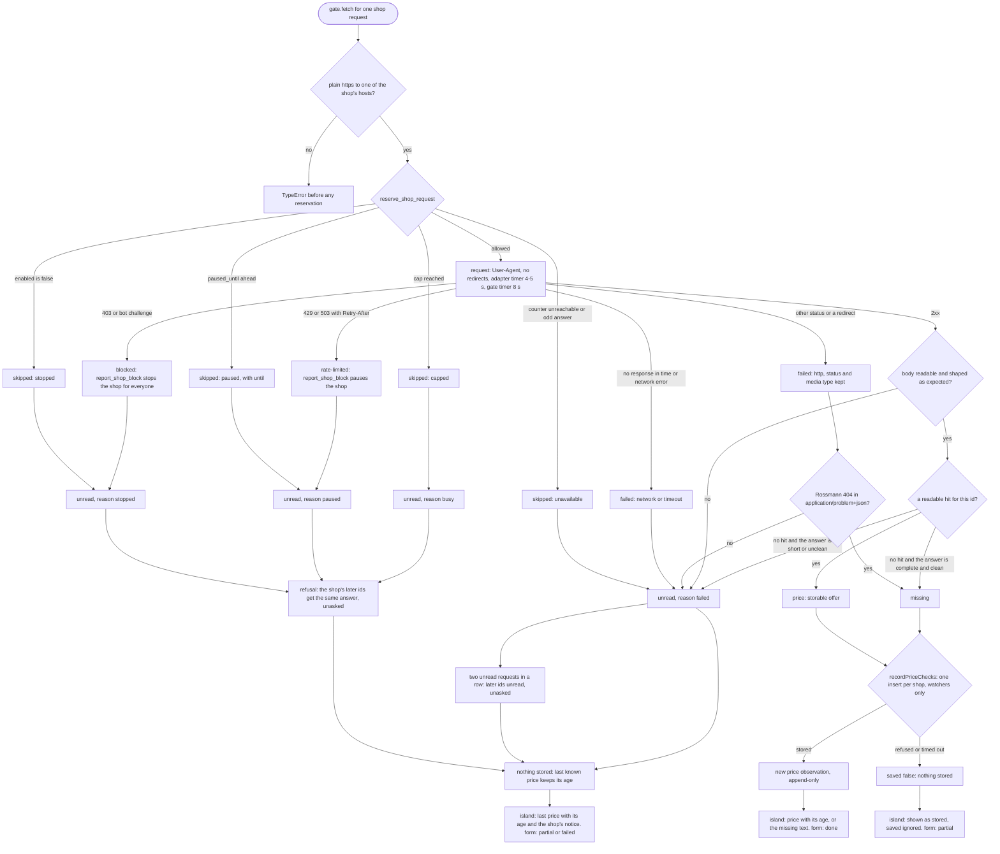

# Research: a refresh, from the shop to the screen (price-refresh-flow-analysis)

**Date**: 2026-10-10T10:17:01+02:00
**Researcher**: Claude (claude-opus-5-5)
**Git Commit**: 5eefce2da9741d6d12a3c2af2b8c63fddabcf72f (`origin/main`; this change's folder isn't committed)
**Branch**: docs/m4-course-lessons
**Repository**: yaroslavkhudchenko/10xcourseproject

Method:

- Three read-only workers each investigated one dimension at this commit: the end-to-end trace with its diagrams, the test gaps, and the blast radius (the static import graph and git co-change).
- Every claim kept in the Feature overview's steps or in Technical debt was re-read here at its `file:line`. Claims that didn't hold were corrected or dropped ("Corrections to the workers' reports").
- Then every structural claim was checked with ast-grep 0.50, and every zero it gave was confirmed with grep ("Claim verification (ast-grep)").
- While this was written, the branch moved to `e3bab79` with two documentation commits that only add files (`context/audits/rules/`, `context/domain/03-anti-corruption-layer.md`); no file cited here changed, so every anchor holds there too.
- Nothing was run: no shop, no Supabase, no server, no browser and no test. Paths are relative to the repository root. Documents another agent may be editing (`context/audits/`, `context/domain/`) are cited from their committed bytes at this commit.
- Short names: after a file's first full path, its name alone. `prices.ts` is always the service, `src/lib/services/prices.ts`; the island's route is written `api/watchlist/prices.ts` (`src/pages/api/watchlist/prices.ts`), and `refresh.ts` is the form's route, `src/pages/api/watchlist/refresh.ts`.
- Labels: **E** evidence, read at the cited lines; **I** inference, reasoning from evidence; **U** unknown.
- Terms follow `context/domain/glossary.md`: a refresh, a price observation, the shop gate, the request cap, a watcher. A check without a readable answer is **unread**; `unavailable` appears only as the code's identifier.

## Research Question

The course's prompt (module 4, lesson 3), adapted to this repository: analyse the refresh, how a price observation is fetched, saved and shown, paying particular attention to the related areas that `context/map/repo-map.md` defines. Describe only the repository's current state.

## Summary

- **What a refresh is.** It fetches a watched product's prices on the user's action („Odśwież ceny”) or when the product page finds a price more than 15 minutes old (`context/domain/glossary.md:73`; PRD FR-008, `context/foundation/prd.md:142`).
- **Two routes, four triggers.**
  - The product page's island asks `POST /api/watchlist/prices`, one JSON request per shop: on its own for each shop last checked more than 15 minutes ago, or for every shop when the user taps its button.
  - The list's „Odśwież ceny”, and the product's own button without JavaScript, post a form to `POST /api/watchlist/refresh`, which answers with a redirect and a code.
- **One pipeline behind both.** Each route reads the shop items from the user's own rows (`price-targets.ts`), never from the request, and calls `refreshPrices` with a shop gate bound to the user's Supabase client. Every priced shop is asked at once, each shop's requests one after the other (`price-refresh.ts:74-78`). Each of the six shop request sites goes through the gate, which reserves a slot under the request cap before the network (`shop-gate.ts:101-120`; claim 4). Each shop's checks are stored with one insert as soon as that shop is done (`price-refresh.ts:84-92`).
- **Shown back** from two `security_invoker` views over the whole table under RLS: `price_summaries` on the product page, `latest_price_observations` on the list. The island updates each card as its shop answers, then tells the selected list row through a `window` event.
- **The write, settled.** The workers disagreed: the trace counted two writers, the blast radius one write path. Both hold at different levels. There is **one write function**, `recordPriceChecks` (`src/lib/services/prices.ts:81-98`), the one insert into `price_observations` in `src/`, with **two production callers**: the refresh (`src/lib/services/price-refresh.ts:91`) and the product page's lookup, which stores an accepted candidate's offer as the item's first price and ignores whether it was stored (`src/lib/services/shop-matching.ts:387-393`).
- **Against the map.** The flow crosses all eight of the map's capabilities, product-search only through `isOwnNavigation`. It confirms risk zones 2 and 3, the price-refresh ⇄ shop-matching pair, the exact `islandConfig` and both price-refresh Watch items. It sharpens two of them: the pair is a shared write at runtime, and the full-history read is paid by every product view and every list refresh too (TD-15). It adds a write-side sibling of risk zone 2 that the map doesn't carry: a check that wasn't stored is shown as stored.
- **Technical debt: 27 items** (TD-01 to TD-27). The three that matter most form one chain:
  - TD-03: the database schema has no compiler, so a change to the insert can drift from the table unseen;
  - TD-18: no test runs the app's own insert against a database, so the drift would first fail in production;
  - TD-02: the product page's island then hides the failure, showing the unstored price as freshly checked, while only the two no-JavaScript forms say „Nie wszystkie ceny udało się odświeżyć” (`price-refresh.ts:148`; `notices.ts:323-326`).
- **ast-grep:** 45 structural claims were checked: 36 confirmed, 8 refined and 1 refuted ("Claim verification (ast-grep)"). The refuted one is the trace's count of seven capabilities, which left out product-search; the refinements are counts (five `logFailure` helpers, not three; more copies of the shop requests in tests and more stand-ins; a third harness writing rows; a second test-only export) and wordings (the gate's five kinds include `ok`; the list's notice text e2e does assert, through the product's form; no test asserting the lookup's failed first price).

## Feature overview

### What a refresh is for the user

- E: the user opens a watched product and sees each shop's price with its source and age, the cheapest marked, while each shop answers on its own (`context/foundation/prd.md:142`, `:151`, `:189`).
- E: a price that couldn't be fetched keeps its last known value and age, or shows a gap, never a blank, a zero or a silently stale value (`CLAUDE.md:19`; `context/foundation/prd.md:49`).
- E: the shops are asked politely: a per-shop cap for the whole deployment, a pause after a 429, a stop after a 403 (`CLAUDE.md:21`; `context/foundation/prd.md:191`).

### Entry points

| #   | Trigger                                                      | Where                                                                                            | Route and transport                                                                     | What it asks for                                                                                                                                                     | Server-side bound                               |
| --- | ------------------------------------------------------------ | ------------------------------------------------------------------------------------------------ | --------------------------------------------------------------------------------------- | -------------------------------------------------------------------------------------------------------------------------------------------------------------------- | ----------------------------------------------- |
| 1   | The product page opens on the user's own navigation          | `src/components/watchlist/PriceComparison.tsx:100-112`; `src/pages/watchlist/[id].astro:119-122` | `POST /api/watchlist/prices`, JSON, one request per shop                                | Each shop whose last check is more than 15 minutes old, judged in the browser on the server's render time                                                            | The request cap only (TD-11)                    |
| 2   | The product's „Odśwież ceny” with JavaScript                 | `PriceComparison.tsx:129-133`; `src/components/watchlist/RefreshForm.tsx:56-66`                  | Same, one request per shop                                                              | Every shop, whatever its age                                                                                                                                         | The request cap only                            |
| 3   | The product's „Odśwież ceny” without JavaScript              | `RefreshForm.tsx:52-69`                                                                          | `POST /api/watchlist/refresh`, form with `itemId` and `f`, 302 with `?prices=<code>`    | Every item of the product (`productTargets`, `src/lib/services/price-targets.ts:150-170`)                                                                            | The request cap                                 |
| 4   | The list's „Odśwież ceny”, on the list or beside a product   | `src/components/watchlist/ListHead.astro:62-71`                                                  | `POST /api/watchlist/refresh`, form with `f` and `back`, 302 with `?list-prices=<code>` | The items last checked more than 15 minutes ago, never-checked first, then oldest first (`price-targets.ts:124-138`; `src/lib/services/price-comparison.ts:650-663`) | The 15 minutes and the request cap              |
| 5   | Not a refresh: the product page's lookup accepts a candidate | `src/lib/services/shop-matching.ts:383-394`                                                      | During the page's render                                                                | Stores the candidate's offer as the item's first price observation                                                                                                   | The lookup's own requests went through the gate |

### Layers it crosses

Browser island → middleware → route → targets from the user's rows (Supabase under RLS) → `refreshPrices` → registry → shop adapter → shared batch rules → shop gate → `reserve_shop_request` → the shop's API → the adapter's reading → `storableOffer` → `recordPriceChecks` → `price_observations` under its insert policy → the two views → the pages and the island.

The modules and their edges (from the blast-radius worker's graph, each import edge re-read at the cited lines; the two POSTs and the window event are runtime edges, not imports):

Anchors for the edges: `src/pages/api/watchlist/prices.ts:2-5`; `src/pages/api/watchlist/refresh.ts:2-11`; `price-targets.ts:3`, `:14-15`; `price-refresh.ts:4-6`; `src/lib/services/shops/registry.ts:2-24`; the adapters' imports, the gate's type among them (`src/lib/services/shops/rossmann.ts:3-13`; `src/lib/services/shops/luigis-box.ts:3-15`; `src/lib/services/shops/super-pharm.ts:4-18`); `src/lib/services/shop-gate.ts:181-199`; `shop-matching.ts:25`; `prices.ts:28`, `:163`, `:176`; `[id].astro:28`; `src/pages/watchlist.astro:23`; `PriceComparison.tsx:117-120`; `src/components/watchlist/RowTag.tsx:54`.

### End-to-end steps

#### A. The product page's island (entry points 1 and 2)

1. The page reads the product and its decisions at once, and beside them the list's three reads, asking no shop (E: `src/pages/watchlist/[id].astro:53-67`).
2. It runs the match steps with a gate built for this request (E: `[id].astro:92-105`, the gate at `:96`). It reads the prices after the steps, so a match a step has just stored comes with the price it was found with (E: `[id].astro:111-116`).
3. `productPricesOf` takes the product's own item and each match's item (`productPriceKeys`, E: `src/lib/services/price-comparison.ts:593-611`). It reads `price_summaries` filtered by `shop_item_id` (E: `src/lib/services/prices.ts:175-190`, `:255-276`, `:347-349`) and hands each priced shop to the island with `readFailed`, and `pricesFailed` for a read that failed as a whole (E: `prices.ts:284-302`, `:312-325`).
4. `autoRefresh` is true only on the user's own navigation and while no re-pin's choice is open (E: `src/lib/services/match-step.ts:90-92`; `[id].astro:119-122`). Own navigation means no prefetch or prerender, and `Sec-Fetch-Site` same-origin, none or absent (E: `src/lib/services/search-query.ts:19-26`; `[id].astro:48`). The island hydrates with `client:load`, with the server's render time as `now` (E: `[id].astro:118`, `:239-256`).
5. The island starts from the stored prices. A failed read marks every row `readFailed` (E: `src/components/watchlist/PriceComparison.tsx:72`; `src/components/watchlist/price-comparison-state.ts:132-159`).
6. What to refetch is decided in the browser:
   - automatically, once, each shop whose last check is more than 15 minutes old on the render clock (`needsRefetch`), only while `autoRefresh` is true (E: `PriceComparison.tsx:100-112`; `price-comparison.ts:121-138`);
   - on the button, every row, whatever its age (E: `PriceComparison.tsx:129-133`); a submit while any refetch runs does nothing (E: `src/components/watchlist/RefreshForm.tsx:56-66`; `src/components/watchlist/PriceComparisonView.tsx:73`).
7. Each refetch is one JSON POST per shop, every shop at once. `start` marks the row pending (E: `price-comparison-state.ts:166-177`). `requestRefresh` posts `{itemId, shop, shopItemId}` with `redirect: "manual"` and its own 20 s timer (E: `price-comparison-state.ts:822-848`, `:41-43`). The `refresh` callback doesn't wait for the one before (E: `PriceComparison.tsx:75-83`, `:107-111`).
8. The middleware builds the request's only Supabase client, calls `auth.getUser()` and sends a signed-out request on a `PROTECTED_ROUTES` prefix (`/api/watchlist` is one) to sign-in (E: `src/middleware.ts:9`, `:15-34`). Every signed-in response gets `Cache-Control: private, no-store` (E: `middleware.ts:39-41`).
9. The route refuses another site (403) and anything but JSON (415) itself (E: `src/lib/json-request.ts:17-23`; `src/pages/api/watchlist/prices.ts:36-42`). A body that isn't JSON (`:43-49`) or fails `priceRequestSchema` (`:50-53`; schema at `src/lib/services/price-targets.ts:28-32`) gets 400, and a missing client 503 `config` (`:54-57`).
10. The shop item comes from the user's rows. `priceTargetFor` → `itemInRows` reads the product first: in its own shop the item is its `sourceItemId`; in a matched shop its decisions are read next and a `matched` decision's item is taken (E: `price-targets.ts:59-101`). Rows that couldn't be read give 503, a product that isn't listed 404 `gone`, and another item or none 409 `changed`, all before any shop request (E: `api/watchlist/prices.ts:59-70`). The request's `shopItemId` is only compared (E: `price-targets.ts:18-21`, `:70`).
11. `refreshPrices(shopGateFor(supabase), supabase, [key])` (E: `api/watchlist/prices.ts:71`), steps C and D.
12. `answerFor` stamps a price or a missing item with `checkedAt`, the server's time after the check, and `saved`; an unread check passes through as it is; the status is 200 (E: `api/watchlist/prices.ts:15-26`, `:72-74`).
13. The island reads the response: an opaque or followed redirect means the session ended; a page that isn't JSON means the session ended when `ok`, else a failure; any other non-OK status but 409 is a failure; a 409 with `changed` means the match changed; anything else goes through the hand parser (E: `price-comparison-state.ts:860-882`, `:890-931`).
14. The row settles (E: `price-comparison-state.ts:234-265`):
    - a price becomes the new `latest`, whose `lastCheckedAt` and `pricedAt` are both the route's `checkedAt`;
    - a missing item keeps the old offer with `lastStatus: "missing"`;
    - an unread answer keeps the last known price and sets a `notice`;
    - an ended session or a changed match only stops the row pending.
    - `saved` is required by the parser (E: `:901-903`) and not read by `settled` (E: `:234-265`).
15. The island renders the order, the marks and the verdict through `compareShops` and `verdictOf`, naming no shop cheapest while a row is `readFailed` or a decision is unreadable (E: `price-comparison-state.ts:295-331`). Only a fresh price orderable online can be cheapest (E: `price-comparison.ts:313-323`). Each card shows the price, the regular price, a promotion's end, „niedostępny online”, the declared 30-day low, „cena online · <age>”, „Najtaniej” or „Nieaktualna”, a gap text without a price, the missing text and the notice (E: `src/components/watchlist/ShopCard.tsx:63-127`; texts at `src/lib/shop-messages.ts:39-69`). The session and changed-match alerts, and a live region with one line per answer, sit above and below the cards (E: `PriceComparisonView.tsx:77-113`, `:126-128`; `price-comparison-state.ts:203-226`).
16. After each change of its rows the island sends `PRICES_EVENT` on `window` (E: `PriceComparison.tsx:117-120`; `price-comparison-state.ts:347`, `:367-375`). The selected row's `RowTag`, an island hydrated only from 64rem (E: `src/components/watchlist/WatchlistRow.astro:93-99`), recomputes its tag with `rowTagOf` (E: `src/components/watchlist/RowTag.tsx:44-58`; `src/lib/services/watchlist-rows.ts:313-322`). The other rows and the chips' counts stay as the server read them, an accepted edge (E: `context/foundation/test-plan.md:412`).

#### B. „Odśwież ceny” as a form (entry points 3 and 4)

1. The list's form posts `f` and, beside a product, `back`, to the route written as a literal (E: `src/components/watchlist/ListHead.astro:62-71`). The product's form posts `itemId` and `f` to `REFRESH_FORM_ROUTE`; with JavaScript the island takes the submit instead (E: `RefreshForm.tsx:52-79`).
2. The middleware checks the session as in A8. A cross-site form post is left to Astro's `checkOrigin` (E: the comment at `src/pages/api/watchlist/refresh.ts:15-16`).
3. A body that isn't a form, an `itemId` that isn't a UUID, or a crafted `back` goes to `/watchlist` with no code (E: `refresh.ts:20-43`; `src/lib/services/price-refresh.ts:174-183`). Without a client the code is `failed` (E: `refresh.ts:48-51`).
4. The targets:
   - the list reads the watchlist, its decisions and `latest_price_observations`, unfiltered, at once, then keeps the items last checked more than 15 minutes ago, never-checked first and then oldest first, each once (E: `price-targets.ts:124-138`; `price-comparison.ts:620-663`; `prices.ts:222-246`);
   - the product without JavaScript reads the product and its decisions at once and takes every item of the product whatever its age, counting matched shops whose decision couldn't be read as unread (E: `price-targets.ts:150-170`).
5. `refreshPrices` runs with all the keys (E: `refresh.ts:59`).
6. The code is `none` when nothing was asked, `failed` when no item got an answer, `done` when every item got a price or a missing check and every insert was stored, and `partial` otherwise (E: `price-refresh.ts:139-149`). The redirect carries `?list-prices=<code>` or `?prices=<code>` and keeps the list's filter (E: `price-refresh.ts:189-199`; `refresh.ts:60`).
7. The page it lands on re-reads the stored prices and asks no shop (E: `src/pages/watchlist.astro:39-56`). It shows `LIST_PRICES_NOTICES` (E: `ListHead.astro:43`, `:73-77`; `src/lib/notices.ts:336-341`) or `PRICES_NOTICES` (E: `[id].astro:153-154`, `:234-238`; `notices.ts:348-353`). Both address bars forget the code once it is shown (E: `watchlist.astro:124-137`; `[id].astro:267-282`).

#### C. Inside `refreshPrices`: fetch and read, per shop

1. The keys are taken once each, in order (E: `price-refresh.ts:71`, `:104-114`). Every shop of `PRICED_SHOPS` gets its fetcher at once, and a shop with no ids is still called and sends nothing (E: `price-refresh.ts:74-78`; the loops at `src/lib/services/shops/pinned-prices.ts:96` and `src/lib/services/shops/rossmann.ts:204` don't iterate). A key in a shop outside the list is unread with reason `failed` (E: `price-refresh.ts:116-119`).
2. The fetchers come from the registry, `PRICE_FETCHERS[shop] = SHOP_ADAPTERS[shop].fetchPrices` (E: `price-refresh.ts:42-44`; `src/lib/services/shops/registry.ts:57-90`).
3. Rossmann, one product per request (E: `rossmann.ts:199-229`):
   - the id must be 1-12 digits before it becomes a path (E: `rossmann.ts:39`, `:254-258`);
   - `GET products/v2/api/Products/<id>?shopNumber=null` through the gate, with a 5 s timer (E: `rossmann.ts:31`, `:37`, `:259-262`);
   - the body is read with `detailSchema` (E: `:271-276`, `:343-361`), an answer about another id is unread (E: `:283-286`), and the offer goes through `toOffer` → `storableOffer` (E: `:379-390`; `src/lib/services/shops/shop-offer.ts:24-37`);
   - only a 404 in `application/problem+json` is missing (E: `:263-270`);
   - a refusal answers the rest with no request; two requests in a row without a response stop the rest; any response resets the count (E: `:205-222`).
4. Natura and Hebe, batches on Luigi's Box (E: `src/lib/services/shops/luigis-box.ts:113-126`):
   - up to 50 ids per request (E: `luigis-box.ts:29`), one `f[]=<idField>:<id>` per id, `size` as many as the ids, `hit_fields` naming only the price attributes (E: `:230-240`), a 4 s timer (E: `:27`, `:191-195`);
   - complete means no next page and a whole `total_hits` of 0 or more, no more than the hits held (E: `:309-336`).
5. Super-Pharm, batches on Algolia:
   - up to 20 ids per POST to one query URL (E: `src/lib/services/shops/super-pharm.ts:40`, `:48`, `:177-179`), form-encoded parameters with `objectID:<id> OR …`, retrieving only `price`, `in_stock` and `inStoreOnly`, with `enableRules=false` (E: `:52`, `:203-215`, `:242-252`), a 4 s timer (E: `:43`);
   - complete means `nbHits` equal to the hits held, on page 0 of at most one page (E: `:259-276`).
6. The rules the batch shops share (E: `pinned-prices.ts:72-122`):
   - ids once each; an id that can't go into a request is never sent (E: `:80-91`);
   - a refusal answers the remaining batches the same way with no request (E: `:98-103`; `src/lib/services/shops/shop-outcome.ts:10-12`);
   - two unread requests in a row leave the rest unread and unasked (E: `:20`, `:104-108`, `:132-137`);
   - an id without a hit is missing only when the answer is complete, every hit was read and every hit was asked for; otherwise it is unread (E: `:180-192`).
7. The shop gate, for each of the six shop request sites (claim 4) (E: `src/lib/services/shop-gate.ts:88-163`):
   - plain https to one of the shop's `SHOP_HOSTS`, or a `TypeError` before reserving (E: `:12-17`, `:89-95`);
   - a reservation first, under a 2 s timer (E: `:101-107`, `:181-190`). The SQL locks the shop row, returns `stopped` when `enabled` is false and `paused` while `paused_until` is ahead, prunes the last 60 s, counts against `cap_per_minute` (30 by default) and inserts the reservation (E: `supabase/migrations/20260926112205_polite_shop_access.sql:9`, `:58-83`). A reservation that can't be read, or `unknown_shop`, is skipped as `unavailable` (E: `shop-gate.ts:105-114`, `:210-222`);
   - the request carries the gate's User-Agent, `redirect: "manual"` and an 8 s timer combined with the adapter's own signal (E: `:20-21`, `:122-133`);
   - its answer is classified: a throw is `failed` with `timeout` only when the gate's own timer fired, else `network` (E: `:134-137`); a 403 or `cf-mitigated: challenge` is `blocked`, and `report_shop_block` stops the shop (E: `:139-146`; SQL `:108-114`); a 429, or a 503 with Retry-After, is `rate-limited`, and the shop is paused (E: `:147-153`; SQL `:99-107`); a 2xx is `ok` (E: `:154-156`); anything else is `failed` `http` with its status and media type (E: `:157-162`);
   - `gateUnavailable` turns these into the reasons the pages show: `capped` → `busy`; `paused` and `rate-limited` → `paused` with `until`; `stopped` and `blocked` → `stopped`; the rest → `failed` (E: `shop-outcome.ts:33-52`).

#### D. The write

1. One insert per shop, as soon as that shop is done (E: `price-refresh.ts:74-78`, `:84-92`).
2. `recordPriceChecks` turns a price into a row with its offer and a missing item into a row without one. A check without an answer adds no row, so the last known price keeps its age. With no rows it sends nothing (`none`); otherwise one insert under a 2 s timer that asks for no rows back, any error being `failed`, logged by its code only (E: `prices.ts:27-31`, `:56-98`, `:403-414`).
3. The database:
   - the insert policy admits only a watcher of the shop item: a listed product in its own shop, or a `matched` decision to it (E: `supabase/migrations/20260928011450_price_observations.sql:109-127`);
   - the column grants leave `id`, `source`, `observed_at` and `recorded_by` to their defaults (E: `:51-56`, `:132-138`);
   - the checks: the id's characters, `status`, a price above 0 and below 100000, `regular_price > price`, and the offer only with a price (E: `:39-65`), plus bounds on the regular price and the 30-day low (E: `supabase/migrations/20261006221608_price_history.sql:18-20`);
   - there is no update or delete path (E: `price_observations.sql:81-82`, `:132-138`).
4. The result goes back to the island as `saved: boolean` (E: `api/watchlist/prices.ts:74`) and into the form's code (E: `price-refresh.ts:148`).

#### E. The reads back

1. `latest_price_observations` is each item's last check by `DISTINCT ON`, with its last priced check joined laterally, so a later missing check keeps the last price. It is `security_invoker`, so the reader's RLS and grants apply (E: `price_observations.sql:140-171`).
2. `price_summaries` is built on that view and adds each item's lowest orderable price and the Warsaw days carrying one in the 30 days before today (E: `price_history.sql:28-72`, `:54`).
3. The product page reads `price_summaries` for its own items (E: `prices.ts:175-190`, `:255-276`). The list, and the list beside a product, read `latest_price_observations` with no filter but RLS (E: `prices.ts:162-169`, `:222-246`; `[id].astro:64-66`; `watchlist.astro:42-47`).
4. The list's rows: `listRowsOf` → `listRowOf` → `priceTagOf(verdictOf(…))` gives a tone, a price, a label and a meta line „<shop> · <age>”, and a row lands in „Do sprawdzenia” for any price that isn't fresh (E: `watchlist-rows.ts:220-245`, `:274-306`, `:470-480`).
5. Freshness and the cheapest mark: stale after 24 hours or once a promotion ended; a missing item never wins; only a fresh price orderable online is eligible (E: `price-comparison.ts:9-11`, `:145-157`, `:313-323`).

#### F. The second caller of the write: the lookup's first price

- E: when the product page's lookup accepts a candidate and its decision is saved, the candidate's offer from the search answer is stored as the item's first price observation, through `recordPriceChecks` directly, not through `refreshPrices`. The result isn't read: "A failed insert is logged, and the island then asks." (`src/lib/services/shop-matching.ts:383-394`). The M-2 plan records the same second write (`context/domain/02-invariant-aggregate-refactor.md:92`).
- I: with that row stored, the page's price read after the steps (`[id].astro:111-116`) brings it back with a fresh last check, so `needsRefetch` is false for that shop and the lookup's request doubles as the refresh. When the insert failed, `latest` is null and the island refetches on the user's own navigation (E: `price-comparison.ts:121-124`).

### Write paths: one function, two callers

| Question                                                       | Answer                                                                                                                                | Evidence                                                                                                                                |
| -------------------------------------------------------------- | ------------------------------------------------------------------------------------------------------------------------------------- | --------------------------------------------------------------------------------------------------------------------------------------- |
| How many functions insert into `price_observations` in `src/`? | One: `recordPriceChecks`                                                                                                              | `prices.ts:28`, `:81-98` (ast-grep below)                                                                                               |
| How many production callers?                                   | Two: `stored` inside `refreshPrices`, and `lookupOutcome`                                                                             | `price-refresh.ts:84-92`; `shop-matching.ts:383-394`                                                                                    |
| Same row mapping and insert?                                   | Yes: both go through `observationRow` and the one `.insert(rows)`                                                                     | `prices.ts:56-74`, `:85-92`                                                                                                             |
| Same failure contract?                                         | No. The refresh reports `saved` to both routes; the lookup drops the result and relies on the island refetching                       | `api/watchlist/prices.ts:74`; `price-refresh.ts:148`; `shop-matching.ts:391-392`                                                        |
| Where else does code write rows?                               | Outside `src/`, three test harnesses insert their own hand copies of the row: the database check, the two-user check and the e2e seed | `scripts/check-prices-db.mjs:120-142`; `scripts/check-two-users.mjs:130-140`, `:188-190`; `tests/e2e/support/watchlist-data.ts:216-245` |

Verdict: the trace's "two writers" (two callers with different contracts) and the blast radius's "one write path" (one function, one statement, one mapper) are both right. TD-01 records the debt.

### What the user sees

| Outcome                                                                                                  | Starts at                                                                                                          | Stored                                                                                            | Product page (the island)                                                                                                                                                                                     | The form's notice                                                                                                                     |
| -------------------------------------------------------------------------------------------------------- | ------------------------------------------------------------------------------------------------------------------ | ------------------------------------------------------------------------------------------------- | ------------------------------------------------------------------------------------------------------------------------------------------------------------------------------------------------------------- | ------------------------------------------------------------------------------------------------------------------------------------- |
| A price                                                                                                  | the adapter                                                                                                        | a `price` row                                                                                     | the card's price with „cena online · <age>”, possibly „Najtaniej” (`ShopCard.tsx:79-113`)                                                                                                                     | counts as answered; `done` when every item answered and every insert stored (`price-refresh.ts:139-149`)                              |
| A missing item: a complete, clean answer without the id, or Rossmann's problem+json 404                  | the adapter (`pinned-prices.ts:183-190`; `rossmann.ts:263-270`)                                                    | a `missing` row; the view keeps the last price (`price_observations.sql:163-171`)                 | the old price, „Nieaktualna” and „Sklep nie zwraca już tego produktu. Cena może być nieaktualna.”, never cheapest (`ShopCard.tsx:84-88`, `:116-118`; `shop-messages.ts:65-68`; `price-comparison.ts:149-151`) | counts as answered; the list's tag reads „Nieaktualna” and the row goes to „Do sprawdzenia” (`watchlist-rows.ts:241-243`, `:289-290`) |
| The request cap reached                                                                                  | SQL `capped` → skipped → `busy` (`polite_shop_access.sql:76-79`; `shop-outcome.ts:36-38`)                          | nothing; the shop's later ids get the same answer, unasked                                        | „Sklep X jest teraz zajęty. Pokazujemy ostatnią znaną cenę.” (`shop-messages.ts:47`)                                                                                                                          | unanswered → `partial` or `failed`                                                                                                    |
| Paused, or a 429 or 503 with Retry-After now                                                             | SQL `paused`, or the gate after the request (`polite_shop_access.sql:68-70`; `shop-gate.ts:147-153`)               | nothing; a new 429 sets `paused_until` for the whole deployment (`polite_shop_access.sql:99-107`) | „Sklep X poprosił o przerwę do około HH:MM. …” (`shop-messages.ts:48-53`)                                                                                                                                     | `partial` or `failed`                                                                                                                 |
| Stopped, or a 403 or bot challenge now                                                                   | SQL `stopped`, or the gate after the request (`polite_shop_access.sql:65-67`, `:108-114`)                          | nothing; `enabled = false` for everyone until the owner turns it back on                          | „Odświeżanie cen w sklepie X jest wyłączone, bo sklep zablokował zapytania.” (`shop-messages.ts:54-55`)                                                                                                       | `partial` or `failed`                                                                                                                 |
| The counter unread: no client, an RPC error or its 2 s timer, an odd answer, an unknown shop             | the gate, before the request (`shop-gate.ts:101-114`, `:172-179`)                                                  | nothing; counts toward the two-in-a-row stop                                                      | „Nie udało się pobrać ceny ze sklepu X.” (`shop-messages.ts:56-57`): the app's own counter reads as the shop's failure (TD-07)                                                                                | `partial` or `failed`                                                                                                                 |
| A shop's failure: another status, an unfollowed redirect, the network, a timer                           | the gate (`shop-gate.ts:134-137`, `:157-162`)                                                                      | nothing                                                                                           | the same failure text, the last price kept                                                                                                                                                                    | `partial` or `failed`                                                                                                                 |
| An unreadable answer: not JSON, the wrong shape, a dropped hit, a hit not asked for, an answer cut short | the adapter (`rossmann.ts:271-276`; `luigis-box.ts:199-202`; `super-pharm.ts:264-267`; `pinned-prices.ts:140-193`) | nothing for the unanswered ids; readable hits still store their prices                            | the failure text                                                                                                                                                                                              | `partial`                                                                                                                             |
| An empty but well-formed answer                                                                          | the adapter (`pinned-prices.ts:183-190`)                                                                           | every asked id stored `missing`, for every watcher: an accepted edge (`test-plan.md:428`)         | the missing text on every card of that shop                                                                                                                                                                   | `done`                                                                                                                                |
| 409 `changed`: a re-pin, a decline or a removal-then-add in another tab                                  | `priceTargetFor` (`price-targets.ts:59-71`)                                                                        | nothing; no reservation                                                                           | „Dopasowanie … się zmieniło. Odśwież stronę, aby zobaczyć aktualne ceny.” (`price-comparison-state.ts:422-425`; `PriceComparisonView.tsx:97-113`); the row keeps its price and marks until reload (TD-23)     | n/a: the form reads its targets fresh                                                                                                 |
| 404 `gone`, 503, 400, 403, 415                                                                           | the route (`api/watchlist/prices.ts:36-70`)                                                                        | nothing                                                                                           | read as a failure, worded as the shop's (`price-comparison-state.ts:869-871`)                                                                                                                                 | a crafted post goes to `/watchlist` with no code                                                                                      |
| Signed out                                                                                               | the middleware (`middleware.ts:27-34`)                                                                             | nothing                                                                                           | „Sesja wygasła. Zaloguj się ponownie, aby odświeżyć ceny.” (`PriceComparisonView.tsx:77-96`)                                                                                                                  | redirect to sign-in                                                                                                                   |
| A failed insert: RLS 42501, a check, the 2 s timer                                                       | `recordPriceChecks` (`prices.ts:92-97`)                                                                            | no row; logged by code                                                                            | the price shows as just checked and can be named cheapest: `saved: false` isn't read (TD-02)                                                                                                                  | `partial` (`price-refresh.ts:148`)                                                                                                    |
| Nothing due                                                                                              | `staleTargets` empty                                                                                               | nothing                                                                                           | n/a                                                                                                                                                                                                           | `none`: „Nic do odświeżenia: ceny sprawdzono w ciągu ostatnich 15 minut.” (`notices.ts:339`)                                          |

### Diagrams

The main path, the island's automatic refetch of one matched shop (Natura):

The second entry point, the form:

One shop request's outcomes, to what the user sees:

### Areas of the repo map this flow crosses

| The map says                                                                                                                                                | What this flow shows                                                                                                                                                                                                                                                                                                                                                                                                                                                                                                                                                                                                      | Verdict                                                                    |
| ----------------------------------------------------------------------------------------------------------------------------------------------------------- | ------------------------------------------------------------------------------------------------------------------------------------------------------------------------------------------------------------------------------------------------------------------------------------------------------------------------------------------------------------------------------------------------------------------------------------------------------------------------------------------------------------------------------------------------------------------------------------------------------------------------- | -------------------------------------------------------------------------- |
| Eight capabilities (`context/map/repo-map.md:15`, `:74-83`)                                                                                                 | The flow crosses all eight: price-refresh (routes, targets, refresh, prices), shop-gate, shop-integrations, price-comparison (the page, its rules, the island), watchlist (reads, row rules, the list), shop-matching (decision reads, `autoRefreshOf`, and the lookup's write), sign-in (the middleware) and product-search, only through `isOwnNavigation` in `search-query.ts`, which decides whether the product page may refresh on its own (`[id].astro:29`, `:48`; the map files it under product-search, `repo-map.md:82`). Plus shared modules (`notices.ts`, `shop-messages.ts`, `json-request.ts`, `types.ts`) | Confirms                                                                   |
| price-refresh's reach is "medium: 6 files, plus the database" (`repo-map.md:80`)                                                                            | The capability's own files are the five the map lists (`:80`), while one refresh touches the files in Code References                                                                                                                                                                                                                                                                                                                                                                                                                                                                                                     | Consistent: the capability is small, the flow isn't                        |
| price-refresh ⇄ shop-matching is "the only service-level two-way pair": `price-targets.ts → matches.ts`, `shop-matching.ts → prices.ts` (`repo-map.md:109`) | Both edges are on the path (`price-targets.ts:3`; `shop-matching.ts:25`). The second is a call of the one write (`shop-matching.ts:392`), not only an import                                                                                                                                                                                                                                                                                                                                                                                                                                                              | Confirms the edges and sharpens them (TD-01); "only" isn't re-checked here |
| Risk zone 2: adapters store or show an unreadable answer as a fact (`repo-map.md:135-145`)                                                                  | On the price path, the shared rule and Rossmann's 404 rule keep an unread answer from becoming missing (`pinned-prices.ts:180-192`; `rossmann.ts:263-270`); two accepted holes remain (`test-plan.md:427-428`). The same defect class appears on the write side, outside the adapters: a check that wasn't stored shown as stored (TD-02)                                                                                                                                                                                                                                                                                 | Confirms; adds a write-side sibling the map doesn't carry                  |
| Risk zone 3: `[id].astro` is the composition root (`repo-map.md:147-154`)                                                                                   | It builds the gate (`:96`), runs the steps (`:92-105`), reads the prices after them (`:111-116`), decides `autoRefresh` (`:119-122`) and makes the list's three reads (`:61-66`). The price composition itself moved into a tested service (`prices.ts:304-311`)                                                                                                                                                                                                                                                                                                                                                          | Confirms                                                                   |
| `price_observations`' RLS is defined over `watchlist_items` and `watchlist_matches` (`repo-map.md:112`)                                                     | Both policies read both tables (`price_observations.sql:89-127`), so an insert succeeds only if the user's decision rows still hold at insert time (TD-04)                                                                                                                                                                                                                                                                                                                                                                                                                                                                | Confirms; adds a runtime consequence                                       |
| `PRODUCT_LIMITS` ↔ SQL and migrations ↔ `types.ts`: "no check compares them" (`repo-map.md:113`)                                                            | `PRICE_LIMITS.max` (`src/lib/services/product-limits.ts:18-20`) agrees with the three SQL bounds (`price_observations.sql:43`; `price_history.sql:19-20`) at this commit; the database check pins literals (`scripts/check-prices-db.mjs:355-371`)                                                                                                                                                                                                                                                                                                                                                                        | Confirms that no check compares them; the values agree today               |
| `islandConfig` is exact at HEAD (`repo-map.md:114`)                                                                                                         | `islandConfig` lists 30 files (`eslint.config.js:95-126`), and the value-import closure of the browser's four roots is exactly those 30: the two hydrated islands, `PriceComparison.tsx` (`[id].astro:240`) and `RowTag.tsx` (`WatchlistRow.astro:95`), and the two modules the pages' `<script>` tags import, `notices.ts` and `theme.ts` (claim 32 below)                                                                                                                                                                                                                                                               | Confirms, at this commit                                                   |
| The island → `RowTag` through `PRICES_EVENT`, unknown to the graph (`repo-map.md:115`)                                                                      | The constant, its type and its parser live in one module (`price-comparison-state.ts:347-408`); the island dispatches it (`PriceComparison.tsx:119`) and only the selected row's tag listens (`RowTag.tsx:54`; `test-plan.md:412`)                                                                                                                                                                                                                                                                                                                                                                                        | Confirms                                                                   |
| `notices.ts` ⇄ `price-refresh.ts`, type-only (`repo-map.md:117`)                                                                                            | `notices.ts:2` type-imports `PriceRefreshCode`; `price-refresh.ts:2` imports two parameter names back (TD-14)                                                                                                                                                                                                                                                                                                                                                                                                                                                                                                             | Confirms                                                                   |
| The gate's runtime reach is `unknown`, injected (`repo-map.md:83`, `:217`)                                                                                  | On this flow every price request goes through `gate.fetch` (`rossmann.ts:259`; `luigis-box.ts:192`; `super-pharm.ts:260`), the gate is built per request in both routes and the page (`api/watchlist/prices.ts:71`; `refresh.ts:59`; `[id].astro:96`), and ESLint refuses the global `fetch` in server code outside the gate (`eslint.config.js:210-226`)                                                                                                                                                                                                                                                                 | Confirms the rule for this flow; the static graph understates the reach    |
| Watch: the full-history read of `latest_price_observations` on every list view, deferred twice (`repo-map.md:158-159`)                                      | Wider: the product page makes the same unfiltered read for the list beside it, `price_summaries` is built on that view, and a list refresh reads it again for its targets (TD-15)                                                                                                                                                                                                                                                                                                                                                                                                                                         | Confirms, wider than stated                                                |
| Watch: the failing-shop stall (`repo-map.md:160`)                                                                                                           | Two failed requests in a row stop a batch shop (`pinned-prices.ts:20`, `:104-108`); Rossmann counts only requests without a response (`rossmann.ts:211-222`), so an erroring Rossmann is asked up to the cap, an accepted edge (`test-plan.md:434`)                                                                                                                                                                                                                                                                                                                                                                       | Confirms: a partial fix and an accepted edge                               |
| First day, items 6 and 7 (`repo-map.md:195-196`)                                                                                                            | The write, the reads and the policies live in those files                                                                                                                                                                                                                                                                                                                                                                                                                                                                                                                                                                 | Confirms                                                                   |

No map statement is contradicted by this flow.

### Evidence, inference and unknown, for the overview

- **Evidence:**
  - Both routes take their shop items from the user's rows and call one pipeline, `refreshPrices` (`api/watchlist/prices.ts:59-71`; `refresh.ts:55-59`).
  - Every price request on this flow goes through `gate.fetch` after a reservation (`shop-gate.ts:101-120`).
  - The one insert is `recordPriceChecks`, called by the refresh and by the lookup (`prices.ts:81-98`; `price-refresh.ts:91`; `shop-matching.ts:392`).
  - The pages read two `security_invoker` views over the whole table (`price_observations.sql:144-171`; `price_history.sql:38-72`).
  - The island ignores `saved` (`price-comparison-state.ts:234-265`, `:901-903`).
- **Inference:**
  - The JavaScript and no-JavaScript paths differ in what they refetch (one shop, any age, against the due items or every item) and in what they say about storing (the island never; the form through `partial`).
  - The price-refresh capability is small, but one refresh crosses all eight capabilities, which is why the map's two-way pair and composition root both show up on it.
- **Unknown:**
  - Whether `supabase-js` answers `{ error }` or throws when the 2 s `AbortSignal` fires on an insert or a read; the code assumes `{ error }` (`prices.ts:92-97`, `:350-354`).
  - Production's `public.shops` values, and what Workers Logs show for these paths (neither was read).
  - How long a long list refresh holds the form post on Workers; nothing in the repository records it.

## Technical debt

Each item gives its kind (structure, duplication, contract, test gap, observability), its evidence, the inference and what is unknown. TD-18 to TD-25 are the test gaps, ranked by risk below; the hand-kept pairs and the seams close the section.

### Code

#### TD-01: one write function, two callers with different failure contracts

- **Kind:** structure.
- **Evidence:** `recordPriceChecks` holds the one insert into `price_observations` in `src/` (`src/lib/services/prices.ts:28`, `:81-98`). Its callers: `refreshPrices` through `stored`, which reports `saved` to both routes (`price-refresh.ts:84-92`; `src/pages/api/watchlist/prices.ts:74`; `price-refresh.ts:148`), and `lookupOutcome`, which stores the accepted candidate's search offer and drops the result (`shop-matching.ts:387-393`). The M-2 plan records the second write (`context/domain/02-invariant-aggregate-refactor.md:92`).
- **Inference:** "store a price check" has one implementation and two contracts. A change to how a check is stored (dedupe, provenance, error reporting) lands in one function but must suit a caller that reports and one that doesn't. The map's two-way pair price-refresh ⇄ shop-matching (`context/map/repo-map.md:109`) is, at runtime, this shared write.
- **Unknown:** none left. The lookup stores an offer shaped like a refresh's: each adapter's search candidate reads its offer through the same reader as its price path, and so through `storableOffer` (`rossmann.ts:116`, `:383`; `natura.ts:122`, `:140`; `src/lib/services/shops/hebe.ts:134`, `:153`; `super-pharm.ts:347`, `:361`; claim 19).

#### TD-02: the island drops `saved`, so a check that wasn't stored shows as fresh and stored

- **Kind:** contract, observability.
- **Evidence:** the route sends `saved` (`src/pages/api/watchlist/prices.ts:74`), documented as "whether the check was stored" (`src/types.ts:267-275`). The island's parser requires it (`price-comparison-state.ts:901-903`), and `settled` never reads it while it sets `lastCheckedAt` and `pricedAt` to `checkedAt` (`:234-246`). The form path counts a failed insert as `partial` (`price-refresh.ts:148`). The observability audit's P6 and its fix order's item 8 describe the same, still open (`context/audits/observability/2026-10-05_1626-prices-sign-in-watchlist-writes.md:97`, `:165`).
- **Inference:** one refresh has two truths, depending on JavaScript. After a failed insert the card says the price was checked „przed chwilą”, it can be named cheapest, and the selected row's tag agrees through `PRICES_EVENT`. A reload brings back the older price with its older age, the island asks the shop again and spends the request cap, no other watcher gets the price, and the history behind the good-price judgement doesn't grow. At the moment of display the price is the shop's current one, so `CLAUDE.md:19` isn't broken; what's wrong is the claim that it is stored.
- **Unknown:** how often inserts fail in production; there's no error tracker and Workers Logs weren't read.

#### TD-03: the database schema has no compiler

- **Kind:** contract.
- **Evidence:** the client is created without a schema type (`src/lib/supabase.ts:13`). No generated database types are tracked and nothing runs `supabase gen types` (`git ls-files`; grep over `package.json`, `scripts/` and `.github/`). Table, view, column and RPC names are strings (`prices.ts:28`, `:101-103`, `:163`, `:176`; `shop-gate.ts:183`, `:193`). The unit tests' stub serves canned rows and lets an insert into any relation given rows succeed (`src/lib/services/testing/stub-supabase.ts:3-6`, `:145-151`).
- **Inference:** a drift between the TypeScript and the SQL, such as a renamed column or a column outside the insert grant, shows only at runtime: as an unread price, as `partial`, in a database check whose own copy changed too, or in production. Neither `astro check` nor the unit suite sees it.
- **Unknown:** whether generated types would fit the null-client contract and the hand-kept zod row schemas without churn.

#### TD-04: one insert per shop, so one refused row loses the shop's checks; the watcher rule is written twice

- **Kind:** contract.
- **Evidence:** a refresh stores each shop's checks with one insert (`price-refresh.ts:84-92`; `prices.ts:92`). The insert policy is the watcher rule in SQL (`price_observations.sql:109-127`); the refresh picks its items by the same rule in TypeScript (`price-comparison.ts:593-611`; `price-targets.ts:80-101`). The glossary names both homes (`context/domain/glossary.md:55`), and the distillation records the rule as enforced by the policies (`context/domain/domain-distillation.md:219`).
- **Inference:** the two agree by construction. A disagreement, or a decline or re-pin in another tab between reading the targets and the insert, makes RLS refuse one row; if PostgREST sends the batch as one statement, the shop's whole insert then fails with 42501 → `failed` → `partial`, logged by code only (`prices.ts:94`). In a list refresh that is every due item of that shop.
- **Unknown:** that PostgREST sends a bulk insert as one statement; it wasn't run here.

#### TD-05: the product's item in a shop is derived two ways

- **Kind:** duplication.
- **Evidence:** `productPriceKeys` (`price-comparison.ts:593-611`) serves the page (`prices.ts:318`), the form route (`price-targets.ts:167`) and the list (`price-comparison.ts:638`). The island's route has its own per-shop derivation, `itemInRows` (`price-targets.ts:80-101`). The M-2 plan lists both among the narrowings it would replace (`context/domain/02-invariant-aggregate-refactor.md:93`, `:278`).
- **Inference:** a rule change, like the accepted edge "a decision stored in a product's own shop" (`context/foundation/test-plan.md:440`), must move in both places, or the JavaScript and no-JavaScript refreshes would ask for different items.
- **Unknown:** when M-2 lands.

#### TD-06: the stop-asking loop is written twice

- **Kind:** duplication.
- **Evidence:** `fetchPinnedPrices` (`pinned-prices.ts:72-122`) and `fetchRossmannPrices` (`rossmann.ts:199-229`) share `FAILED_REQUESTS_BEFORE_STOP`, `failuresAfter` and `logRequestsStopped` (`rossmann.ts:4-10`) but not the loop. Rossmann counts only requests it gave no response to (`rossmann.ts:187-198`, `:211-222`), the owner's call (`test-plan.md:359`). Only the batch loop takes each id once (`pinned-prices.ts:80`); Rossmann relies on `refreshPrices`' `distinct` (`price-refresh.ts:71`).
- **Inference:** "stop asking a shop that refuses or keeps failing" is a deployment-wide rule split across two loops, and a third shop asked one item per request would add a third. The accepted edge that an erroring Rossmann is asked up to the cap (`test-plan.md:434`) lives only in the second.
- **Unknown:** none.

#### TD-07: the reasons flatten layer by layer

- **Kind:** observability.
- **Evidence:** the gate's four outcome kinds besides `ok`, with their four skip reasons and three failure reasons (`src/types.ts:21-26`), become four reasons, the counter's failure folded into `failed` (`shop-outcome.ts:33-52`). Seven route error codes (`src/pages/api/watchlist/prices.ts:9`) become one island failure, `changed` aside (`price-comparison-state.ts:869-880`), worded as the shop's failure (`shop-messages.ts:56-57`). The form keeps four codes with no shop named (`price-refresh.ts:125-149`). The audit's P4, P5 and P10 describe the same flattening (`context/audits/observability/2026-10-05_1626-prices-sign-in-watchlist-writes.md:95`, `:96`, `:101`).
- **Inference:** a product removed in another tab (404 `gone`), a broken reservation RPC and a dead shop all read „Nie udało się pobrać ceny ze sklepu X.”. The cause shows only in a warn line, when there is one.
- **Unknown:** none; whether to tell them apart is a product choice. One clause of P5 no longer holds: Rossmann's loop now stops after two requests in a row without a response, the counter's skips included (`rossmann.ts:190-195`, `:211-215`, `:220-222`), so it no longer reserves again for every product.

#### TD-08: the time limits stack without one budget, and a shop that times out is logged as `network`

- **Kind:** observability.
- **Evidence:** the adapters' timers are 4-5 s (`luigis-box.ts:26-27`; `super-pharm.ts:42-43`; `rossmann.ts:36-37`), under the gate's 8 s (`shop-gate.ts:21`), and the gate tags only its own timer as `timeout` (`:134-137`). The island's 20 s budget is reasoned from the gate's 8 s (`price-comparison-state.ts:41-43`). The middleware's `getUser` has no timer (`middleware.ts:19-21`), and the form route has no overall deadline (`refresh.ts:59`). The audit's P9 (`context/audits/observability/2026-10-05_1626-prices-sign-in-watchlist-writes.md:100`).
- **Inference:** each of the six shop request sites passes a 4 or 5 s timer (claim 8), so while those stay below the gate's 8 s, a shop request that runs out of time is logged as `failed` with `network`, the TimeoutError only in the note. The budgets are written in four places that don't refer to each other.
- **Unknown:** the route's real worst case on workerd against the island's 20 s.

#### TD-09: the database plumbing repeats, with diverging log rules

- **Kind:** duplication, observability.
- **Evidence:** `DATABASE_TIMEOUT_MS = 2000` is declared in `prices.ts:27`, `matches.ts:26` and `watchlist.ts:27`, beside the gate's `COUNTER_TIMEOUT_MS` (`shop-gate.ts:26`). `logFailure` is defined in five modules, all on this path (`prices.ts:411`; `pinned-prices.ts:235`, which Luigi's Box and Super-Pharm import; `rossmann.ts:508`; `matches.ts:621`; `watchlist.ts:349`). `prices.ts` logs a database error's code, "never its message", because a message can quote a row or a filter (`prices.ts:403-409`), while the target reads of the same refresh log `error.message`: `listMatches` (`src/lib/services/matches.ts:457`), `listMatchStates` (`:525`), `listWatchlist` (`src/lib/services/watchlist.ts:181`) and `getWatchlistProduct` (`:246`).
- **Inference:** one refresh's log lines follow two redaction rules, and a new table or shop would copy one of them.
- **Unknown:** whether those messages ever carried a shop item id or a user's text in production.

#### TD-10: nothing catches a fetcher that throws

- **Kind:** contract.
- **Evidence:** the fetchers' contract says they never throw (`registry.ts:34`; `price-refresh.ts:32-34`), but `gate.fetch` throws a `TypeError` for a URL outside the shop's hosts, before reserving (`shop-gate.ts:89-95`), and the adapters call it without a catch (`rossmann.ts:259`; `luigis-box.ts:192`; `super-pharm.ts:260`). `refreshPrices` has no per-shop catch (`price-refresh.ts:74-78`), and neither route catches around it (`src/pages/api/watchlist/prices.ts:71`; `refresh.ts:59`). The match steps do catch per shop (`shop-matching.ts:318-328`).
- **Inference:** a programming error, such as a host missing from `SHOP_HOSTS`, would reject the whole refresh: a 500 for the island's request, read as a failure, and a 500 page for the form. `Promise.all` rejects without waiting for the other shops (`price-refresh.ts:74-78`): what they had stored stays, and the answer reports none of it. The unit tests run the real gate with the real URLs, so such a drift would most likely fail `npm run test` first.
- **Unknown:** whether the other shops' fetches and inserts still finish on Workers once the 500 is sent; what Astro's 500 page looks like there for a form post.

#### TD-11: the 15-minute rule lives only in the callers

- **Kind:** contract.
- **Evidence:** the browser applies `needsRefetch` before an automatic refetch (`PriceComparison.tsx:106-111`), and the list's targets apply it (`price-targets.ts:136-137`; `price-comparison.ts:650-651`). The button and the product's form refetch every item (`PriceComparison.tsx:129-133`; `price-targets.ts:150-170`). The JSON route checks no age (`src/pages/api/watchlist/prices.ts:59-71`).
- **Inference:** deliberate for the user's own taps, but on the island's route the only server-side bound is the request cap, and the origin check (`json-request.ts:17-23`) limits the callers to the app's own pages.
- **Unknown:** whether the owner wants a server-side floor.

#### TD-12: the JSON route's wire contract is restated by hand

- **Kind:** contract, duplication.
- **Evidence:** the request schema (`price-targets.ts:28-32`), the answer builder (`src/pages/api/watchlist/prices.ts:15-26`), and the request builder and hand parser in the island's state module (`price-comparison-state.ts:822-948`), around one type (`src/types.ts:272-275`). The parser restates the reasons as `REASONS` (`price-comparison-state.ts:886`) beside `SearchUnavailableReason` (`src/types.ts:141`), avoiding zod on purpose (`:884-885`). The island tells only `changed` apart among the route's seven error codes (`src/pages/api/watchlist/prices.ts:9`; `price-comparison-state.ts:869-880`). The parser is tested with literals (`src/components/watchlist/price-comparison-state.test.ts:634-652`).
- **Inference:** a typed array can be a subset, so nothing checks that `REASONS` is complete; a new reason or field means three hand-written places and no test across the wire.
- **Unknown:** none.

#### TD-13: the offer is mapped by hand in five layers

- **Kind:** duplication.
- **Evidence:**
  - SQL: the offer columns and checks (`price_observations.sql:41-65`);
  - `prices.ts`: `ObservationRow`, `NO_OFFER`, `observationRow`, `LATEST_COLUMNS`, `latestRowSchema`, `toLatestPrice` (`prices.ts:34-74`, `:101-143`, `:379-401`);
  - types: `ShopOffer`, `LatestPrice` (`src/types.ts:217-227`, `:259-265`);
  - adapters: `storableOffer` (`shop-offer.ts:24-37`) and each adapter's reader, such as Rossmann's `toOffer` (`rossmann.ts:379-390`);
  - the island: `parseOffer` (`price-comparison-state.ts:912-931`).
  - `storableOffer` passes `promoEndsOn` through unchecked (`shop-offer.ts:34`). Rossmann and Super-Pharm check their dates themselves (`rossmann.ts:402-406`; `super-pharm.ts:436-446`), while Natura and Hebe always send none (`natura.ts:144`; `hebe.ts:157`).
- **Inference:** the first new offer field would touch every layer, the test copies (TD-26) and possibly a re-recorded fixture.
- **Unknown:** none.

#### TD-14: `price-refresh.ts` also carries the form route's URL contract

- **Kind:** structure.
- **Evidence:** the codes, their parser and the way-back builders (`price-refresh.ts:121-199`) import `notices.ts`, `watchlist.ts` and `watchlist-rows.ts` only for redirects (`:2`, `:7-8`). Both pages import the refresh service for `parsePriceRefreshCode` alone (`[id].astro:27`; `watchlist.astro:22`). `notices.ts` type-imports `PriceRefreshCode` (`notices.ts:2`) while `price-refresh.ts` imports two parameter names from it (`price-refresh.ts:2`): a cycle whose one side is type-only.
- **Inference:** the refresh service's reach is wider than the refresh, and the pages depend on it for a string parser.
- **Unknown:** none.

#### TD-15: every list view, product view and list refresh reads the latest view over the whole table

- **Kind:** structure.
- **Evidence:** `latest_price_observations` runs `DISTINCT ON` over all of `price_observations` under the caller's RLS (`price_observations.sql:158-171`). The list reads it with no filter but RLS (`prices.ts:222-223`, `:347-349`); the product page makes the same read for the list beside it (`[id].astro:64-66`); `price_summaries` is built on that view (`price_history.sql:54`), and F4's rework to drive it from the caller's watched items was left for later (`price_history.sql:8-11`); a list refresh reads it again for its targets (`price-targets.ts:128-132`). The map lists it under Watch, deferred twice (`repo-map.md:158-159`, `:214`).
- **Inference:** each of those reads costs a pass over a table that is append-only and never pruned (`context/domain/domain-distillation.md:217`), so the cost grows with every check.
- **Unknown:** Postgres's plan for these `security_invoker` views, and whether `.in("shop_item_id", …)` is pushed into the `DISTINCT ON`; the table's size in production.

#### TD-16: constants mirrored in comments, texts, SQL and a test harness

- **Kind:** duplication.
- **Evidence:**
  - the 15 minutes: `REFETCH_AFTER_MS` (`price-comparison.ts:9`) and the text "ceny sprawdzono w ciągu ostatnich 15 minut." (`notices.ts:339`);
  - the 30-day window: `HISTORY_WINDOW_DAYS` (`price-comparison.ts:16`) and `- 30` with 'Europe/Warsaw' in SQL (`price_history.sql:60-71`), linked by a comment (`:35`);
  - the retry bounds (`shop-gate.ts:22-24`) and SQL (`polite_shop_access.sql:104`); the request cap only in SQL (`:9`);
  - the batch sizes (`luigis-box.ts:29`; `super-pharm.ts:48`) restated in a doc comment (`price-refresh.ts:38-39`);
  - `PRICE_LIMITS.max` (`product-limits.ts:15-20`) and the SQL bounds (`price_observations.sql:43`; `price_history.sql:19-20`), pinned in the database check by literals (`scripts/check-prices-db.mjs:355-371`), which tests no price of 100000 itself;
  - the e2e harness's shop item id rule says it is the database's (`scripts/e2e-local-db.mjs:22-23`) but lacks the letter-or-digit part of `price_observations.sql:39`.
- **Inference:** cheap today, one more file per change; one copy has already drifted (the e2e rule, harmless since it is looser).
- **Unknown:** none.

#### TD-17: two test-only exports on the path

- **Kind:** structure.
- **Evidence:** `fetchRossmannPrice` (`rossmann.ts:238-240`) is called only by `rossmann.test.ts`; production uses `fetchRossmannPrices` (`registry.ts:61`). `shopItemFor` (`price-targets.ts:43-50`) is called only by `price-targets.test.ts`; the route uses `priceTargetFor` (`api/watchlist/prices.ts:61`), and both wrap `itemInRows`.
- **Inference:** each is a second public entry to the same work, kept for its tests.
- **Unknown:** none.

### Test gaps

#### TD-18: the write never runs against a database

- **Kind:** test gap.
- **Evidence:** the only database-backed unit test is `src/lib/services/matches.db.test.ts` (`git ls-files`; the default run excludes `*.db.test.ts`, `vitest.config.ts:12-14`). `scripts/check-prices-db.mjs` inserts a hand copy of the app's row (`:120-142`), where the test plan asks for "the real service function, never a hand copy of its query, which drifts" (`context/foundation/test-plan.md:138`). Two more harnesses insert their own copies: the two-user check on the preview (`scripts/check-two-users.mjs:130-140`, `:188-190`) and the e2e seed (`tests/e2e/support/watchlist-data.ts:216-245`); and e2e runs with every shop stopped, so no refresh reaches an insert (`test-plan.md:173-175`). The unit stub lets inserts succeed (`stub-supabase.ts:145-151`).
- **Inference:** with TD-03, a change to the insert (a `.select()` after it, a column outside the grant, a renamed column) would fail every insert in production while the unit suite, the database checks and e2e stay green; with TD-02, the product page would hide it.
- **Unknown:** none.

#### TD-19: the browser sees only the `stopped` answer; the row tag and the alerts never render in a test

- **Kind:** test gap.
- **Evidence:** e2e answers every refetch with `stopped` (`test-plan.md:175`), and no spec stubs a route (no `page.route` or `fulfill` in `tests/e2e`). e2e runs at 390 × 844 (`playwright.config.ts:49`), while the selected row's `RowTag` hydrates only from 64rem (`WatchlistRow.astro:93-99`). There are no component tests (`vitest.config.ts:15`; no Testing Library in `package.json`).
- **Inference:** a card that doesn't re-render a new price, a missing text that never shows live, a desktop tag that keeps a mark the product withdrew, or an alert that never appears would go unnoticed.
- **Unknown:** none.

#### TD-20: the cap's 60-second window and a pause's end are unproved in SQL

- **Kind:** test gap.
- **Evidence:** `scripts/check-shop-gate-db.mjs` never names `requested_at` or `paused_until`, so nothing moves a reservation or a pause into the past; the prune and the pause comparison are `polite_shop_access.sql:68`, `:72-74`.
- **Inference:** a regression there would leave a shop `capped` after its first 30 requests, or `paused` after its first 429, for everyone and for good, and CI wouldn't see it.
- **Unknown:** none.

#### TD-21: the guards that keep a page view from spending the request cap are proved only as functions

- **Kind:** test gap.
- **Evidence:** `isOwnNavigation` (`search-query.ts:19-26`) and `autoRefreshOf` (`match-step.ts:90-92`) are pure functions with unit tests (`src/lib/services/search-query.test.ts`, `src/lib/services/match-step.test.ts`). Their wiring is the page (`[id].astro:48`, `:119-122`) and the island (`PriceComparison.tsx:100-112`), and the tap guard (`RefreshForm.tsx:62`; `PriceComparisonView.tsx:73`) and the list form's send-once (`ListHead.astro:63`) are wiring too. No e2e spec double-taps or opens the product from another site: `tests/e2e` holds no `dblclick`, `clickCount`, `cross-site`, `Sec-Fetch-Site`, `Referer` or `prefetch` (claim 37).
- **Inference:** a link from another site or a prefetch that refetched every stale shop, or a double tap that sent each shop's request twice, would spend the cap everyone shares; one 403 stops a shop for everyone.
- **Unknown:** none.

#### TD-22: the list's „Odśwież ceny” never runs in a browser

- **Kind:** test gap.
- **Evidence:** no e2e spec names the list's button („wszystkich produktów”, `ListHead.astro:68`) or its parameter `list-prices`; the one refresh notice e2e asserts is the product form's `failed` (`tests/e2e/phone-refresh-no-js.spec.ts:39-43`), a text the list shares (`notices.ts:327-330`, claim 36). The form is `ListHead.astro:62-71` and its texts `notices.ts:336-341`.
- **Inference:** a form that loses `f` or `back`, or a `partial` or `failed` result that shows no alert, would go unnoticed. The prices still show their ages, so it's not a wrong number.
- **Unknown:** none.

#### TD-23: a stale tab after a re-pin keeps its marks, and no test pins them

- **Kind:** test gap; the intent is unknown.
- **Evidence:** on `match-changed` the row only stops pending and keeps its price (`price-comparison-state.ts:261-263`); the marks are withdrawn only for unread rows or decisions (`:305-314`); the alert asks for a reload (`PriceComparisonView.tsx:97-113`). The review that brought in the 409 accepted a reload as its tradeoff (`context/archive/2026-10-02-hebe-in-comparison/reviews/impl-review.md:58-60`).
- **Inference:** until the reload, the old item can stay „Najtaniej” beside the alert.
- **Unknown:** whether that is intended.

#### TD-24: holes in the routes' contract tests

- **Kind:** test gap.
- **Evidence:** the price route's tests match the answer without `checkedAt` though the clock is faked (`src/lib/services/price-routes.test.ts:232-233`, `:307-311`, `:395`), and none mentions a `missing` answer (claim 38). The refresh route's tests always send a form (`refreshRequest`, `price-routes.test.ts:223-229`) through a working client, so its non-form body (`refresh.ts:21-26`), missing client (`:49-51`) and unreadable targets (`:56-58`) have no route test; the price route's missing client has one (`price-routes.test.ts:280`, `:283`). No test makes a fetcher throw (TD-10).
- **Inference:** a broken `missing` answer would read as a failed refetch and never say the item is gone; a wrong `checkedAt` would give a fresh price a wrong age.
- **Unknown:** none.

#### TD-25: a failed page price read refetches every shop, and nothing counts it

- **Kind:** test gap.
- **Evidence:** a failed read starts every row `readFailed` with no `latest` (`price-comparison-state.ts:144-152`), and `needsRefetch(null)` is true (`price-comparison.ts:121-124`). The product page's heavier read timing out on its own is an accepted edge (`test-plan.md:421`).
- **Inference:** each own-navigation view then asks every shop, whatever its age.
- **Unknown:** none.

#### TD-26: shop requests, rows and offers spelled out in many test files

- **Kind:** duplication.
- **Evidence:** the observation row is copied in `scripts/check-prices-db.mjs:120-142`, `scripts/check-two-users.mjs:130-140` and `tests/e2e/support/watchlist-data.ts:216-245`, and the view's column list in `scripts/check-prices-db.mjs:148-151`. Each shop's request is restated as a literal across test files: Super-Pharm's Algolia host in 7, Natura's tracker id in 7, Hebe's in 8 and Rossmann's detail path in 4 (claim 40). The code expects tracker ids to change (`src/lib/services/shops/natura.ts:14-16`; `src/lib/services/shops/hebe.ts:15-18`).
- **Inference:** a tracker id or parameter change, or a column change, edits many files. The rules require tests to pin the URLs, so the debt is the number of copies, not the pinning.
- **Unknown:** none.

#### TD-27: hand-rolled Supabase stand-ins beside the shared stub

- **Kind:** test gap, duplication.
- **Evidence:** the shared `stubSupabase` (`src/lib/services/testing/stub-supabase.ts:1-6`, `:203`) is imported by two test files, the route and seam tests, while six test files on this flow define their own `stubClient` (`price-refresh.test.ts:280`, `prices.test.ts:80`, `matches.test.ts:139`, `price-targets.test.ts:138`, `shop-gate.test.ts:41`, `shop-matching.test.ts:1071`), and `watchlist.test.ts` builds four more by hand (claim 41). In the shared stub an insert succeeds unless the test gives the relation as an error (`stub-supabase.ts:145-151`).
- **Inference:** a harmless change to a query chain breaks several files, and the route tests' `saved: true` is a property of the stub's setup, not of the database.
- **Unknown:** none.

### Test gaps ranked by risk

1. **TD-18**, the write never runs against a database. A drift in the insert fails in production first, and TD-02 hides it on the product page.
2. **TD-19**, no refetch answer but `stopped` is ever rendered. A stale or wrong cheapest mark on the screen the shopper acts on.
3. **TD-20**, the cap's window and a pause's end. A deployment-wide outage that CI can't see; prices keep their ages, so it is visible to users.
4. **TD-21**, the cap-spending guards. A view or a double tap that spends the shared cap, and one 403 stops a shop for everyone.
5. **TD-22**, the list's refresh in a browser. The shopper isn't told a refresh fell short; prices keep their ages.
6. **TD-23**, the marks after `changed`. The wrong shop can stay marked cheapest until a reload.
7. **TD-24**, the routes' contract holes. A broken `missing` answer or a wrong age.
8. **TD-25**, a failed page read. Extra requests against the cap.
9. Observability and platform: a slow shop logged as `network` (TD-08); the gate's shop path never runs on workerd in CI (`test-plan.md:296`); the price's own 100000 bound untested (TD-16); and no test asserts what follows when the lookup's first price fails to store, since the lookup tests' two failing stubs fail only `watchlist_matches` (`src/lib/services/shop-matching.test.ts:1296`, `:1318`; TD-01, claim 45).

### Hand-kept pairs that must change together

No pair has a generated layer: no database types are generated and the client has no schema type (TD-03).

| One side                                                                                          | The other side                                                                                                                  | What guards it today                                                                                              |
| ------------------------------------------------------------------------------------------------- | ------------------------------------------------------------------------------------------------------------------------------- | ----------------------------------------------------------------------------------------------------------------- |
| `SHOP_IDS` (`src/types.ts:2`)                                                                     | the `public.shops` seed (`polite_shop_access.sql:40-44`) and the foreign key (`price_observations.sql:37`)                      | nothing at compile time; at runtime `unknown_shop` becomes `unavailable` with a log note (`shop-gate.ts:112-113`) |
| `ShopOffer` and `PriceCheck` (`src/types.ts:217-233`)                                             | the offer columns and checks (`price_observations.sql:41-65`)                                                                   | the hand mapping `observationRow` (`prices.ts:34-74`)                                                             |
| `LatestPrice` and `PriceHistory` (`src/types.ts:249-265`)                                         | the views' columns (`price_observations.sql:147-157`; `price_history.sql:41-53`)                                                | zod at runtime, an odd row read as unread (`prices.ts:122-151`, `:379-401`)                                       |
| `GateOutcome` (`src/types.ts:21-26`)                                                              | `reserve_shop_request`'s JSON and `report_shop_block`'s kinds (`polite_shop_access.sql:47-83`, `:99-117`)                       | `readReservation` fails closed (`shop-gate.ts:210-222`); `ShopBlockKind` (`:29`)                                  |
| the insert grant, 8 columns (`price_observations.sql:137-138`)                                    | `ObservationRow`, the same 8 (`prices.ts:34-43`)                                                                                | nothing; a ninth field fails the shop's whole insert with 42501 (I)                                               |
| `LATEST_COLUMNS` (`prices.ts:101-103`)                                                            | the view (`price_observations.sql:147-157`), and `price_summaries`, which lists the columns by hand (`price_history.sql:41-53`) | a copy in the database check (`check-prices-db.mjs:148-151`)                                                      |
| `PRICE_LIMITS.max` (`product-limits.ts:18-20`) and "regular above the price" (`shop-offer.ts:32`) | the SQL bounds (`price_observations.sql:43`, `:57`; `price_history.sql:19-20`)                                                  | `storableOffer` (`shop-offer.ts:11-17`); the database check's literals (`check-prices-db.mjs:355-371`)            |
| `shopItemIdSchema` (`matches.ts:34-37`)                                                           | the table's id rule, which also asks for a letter or digit (`price_observations.sql:39`)                                        | the adapters' id checks before a request (`pinned-prices.ts:80-91`; `rossmann.ts:39`)                             |
| `SHOP_HOSTS` (`shop-gate.ts:12-17`)                                                               | the adapters' URLs (`rossmann.ts:28`, `:31`; `luigis-box.ts:23`; `super-pharm.ts:40`)                                           | the gate's `TypeError` (`shop-gate.ts:92-94`), uncaught (TD-10)                                                   |
| the watcher rule in TypeScript (`price-comparison.ts:593-611`; `price-targets.ts:80-101`)         | the RLS policies (`price_observations.sql:89-127`)                                                                              | nothing; a disagreement costs a shop's whole insert (TD-04)                                                       |
| `HISTORY_WINDOW_DAYS`, `REFETCH_AFTER_MS`, the retry bounds, the batch sizes                      | their SQL, text and comment copies                                                                                              | nothing but comments (TD-16)                                                                                      |
| `SearchUnavailableReason` (`src/types.ts:141`)                                                    | the island's `REASONS` (`price-comparison-state.ts:886`)                                                                        | nothing checks completeness (TD-12)                                                                               |
| `PRICES_ROUTE` and `REFRESH_FORM_ROUTE` (`price-comparison-state.ts:38-40`)                       | the literal in `ListHead.astro:63` and the middleware's prefix (`middleware.ts:9`)                                              | nothing                                                                                                           |

### Seams: where a change stays contained, and where it ripples

Contained, an interface exists:

1. A new shop's prices: `ShopAdapter.fetchPrices` (`registry.ts:34-55`), with `PRICE_FETCHERS` derived from it (`price-refresh.ts:36-44`).
2. Politeness: `ShopGate` and `createShopGate(deps)` (`shop-gate.ts:46-71`), `gateUnavailable` once for every adapter (`shop-outcome.ts:33-52`), and the batch rules in `fetchPinnedPrices` (`pinned-prices.ts:72-122`).
3. Storing: `recordPriceChecks` (`prices.ts:81-98`), the one insert, so the column names live in one app file (TD-01 for its two callers).
4. Reading: `LatestView` and `readLatestRows` (`prices.ts:153-190`, `:341-376`), one reader and one row schema for both views.
5. Rules shared by the server and the browser: `price-comparison.ts` (`needsRefetch` `:121-138`, `productPriceKeys` `:593-611`, `staleTargets` `:650-663`, `keyText` `:686-688`).
6. The trust boundary: `price-targets.ts`, where the routes never fetch what the request names (`:18-21`, `:59-71`).
7. The browser boundary: `islandConfig` (`eslint.config.js:94-159`).
8. Codes to texts: `PRICE_REFRESH_CODES` (`price-refresh.ts:125`) and `Record<PriceRefreshCode, …>` (`notices.ts:336-353`), so a new code fails type-checking until both pages have its text.
9. The live row tag: `PRICES_EVENT`, its type and its parser in one module (`price-comparison-state.ts:347-408`).
10. The page and its test: `productPricesOf` (`prices.ts:304-325`), which the seam test runs.

Ripples, no seam:

1. The observation's shape: a new offer field crosses every layer of TD-13 and the copies of TD-26.
2. The JSON wire contract (TD-12).
3. Shop identity between SQL and TypeScript (the `SHOP_IDS` pair).
4. The gate's SQL contract: a block kind the SQL doesn't know raises (`polite_shop_access.sql:115-117`); the gate swallows the error into its log note (`shop-gate.ts:78-85`) and still answers `blocked` or `rate-limited`, so the shop wouldn't be stopped or paused in the database (I).
5. The history window between TypeScript and the view (TD-16).
6. Route paths, parameters and bodies as literals (the route-path pair; TD-26).
7. Adapter requests pinned in tests, with fixtures recorded once by hand (TD-26).
8. The watcher rule (TD-04).
9. Change already coming: the M-2 plan replaces `productPriceKeys`, `itemInRows` and the price-key derivations, and lists the `price-targets` and `prices` unit suites among those that follow (`context/domain/02-invariant-aggregate-refactor.md:278`, `:290`).

## Claim verification (ast-grep)

Every structural claim of this document, a count, an "only", an "always through", a "no test", was checked against the code at this commit.

- **How:** ast-grep 0.50.0, the binary `npx --yes -p @ast-grep/cli ast-grep` runs, called as `ast-grep run -p '<pattern>' -l ts|tsx|js --json=compact <paths>`, or `ast-grep scan --rule <rule.yml>` for the rules quoted below. `.astro` and `.sql` files, which this ast-grep doesn't parse, were checked with grep.
- **Zeros:** every zero was confirmed with grep, and every zero from a rule had a positive control on a known match: the `try` rule found the adapters' `response.json()` reads (`luigis-box.ts:313`, `super-pharm.ts:305`, `rossmann.ts:347`), and the string rule found `reserve_shop_request` in `scripts/check-shop-gate-db.mjs:49`.
- **One bad pattern:** `function logFailure($$$) { $$$ }` found 0 where grep found 5 definitions: the pattern leaves out the `: void` return type, so it never matches. A `kind: function_declaration` rule, and the pattern with `: void`, both find the 5 (claim 10).
- **Tally:** 45 claims, 36 confirmed, 8 refined, 1 refuted.

|   # | Claim                                                                                                                        | Verdict                              | Evidence                                                                                                                                                                                                                                                                                                                                                                              | Method                                                                                                                                                                          |
| --: | ---------------------------------------------------------------------------------------------------------------------------- | ------------------------------------ | ------------------------------------------------------------------------------------------------------------------------------------------------------------------------------------------------------------------------------------------------------------------------------------------------------------------------------------------------------------------------------------- | ------------------------------------------------------------------------------------------------------------------------------------------------------------------------------- |
|   1 | One function inserts into `price_observations` in `src/`: `recordPriceChecks`                                                | confirmed                            | the three `.insert(` calls outside tests are `watchlist.ts:123` (`watchlist_items`), `matches.ts:303` (`watchlist_matches`) and `prices.ts:92` (`TABLE`, `"price_observations"` at `:28`); no `upsert`                                                                                                                                                                                | `$X.insert($$$)`; `$C.from(TABLE)`; zeros for `$C.from("price_observations")` and `$X.upsert($$$)`, grep                                                                        |
|   2 | `recordPriceChecks` has two production callers                                                                               | confirmed                            | `price-refresh.ts:91`; `shop-matching.ts:392`; its 6 other calls are in `prices.test.ts`                                                                                                                                                                                                                                                                                              | `recordPriceChecks($$$)`                                                                                                                                                        |
|   3 | Outside `src/`, two harnesses insert hand copies of the row                                                                  | refined: three                       | `scripts/check-prices-db.mjs:122-142` (inserts from `:216`), `scripts/check-two-users.mjs:130-140`, `:188-190`, `tests/e2e/support/watchlist-data.ts:218`, `:234`                                                                                                                                                                                                                     | `$X.insert($$$)` over `scripts` (js) and `tests` (ts); grep `price_observations`                                                                                                |
|   4 | Every shop request goes through `gate.fetch`, none through a direct `fetch`                                                  | confirmed                            | 6 `gate.fetch` calls outside tests, 3 for prices (`rossmann.ts:259`, `luigis-box.ts:192`, `super-pharm.ts:260`) and 3 for searches (`rossmann.ts:144`, `luigis-box.ts:130`, `super-pharm.ts:119`); the one `globalThis.fetch` is the gate's own (`shop-gate.ts:205`); no bare `fetch(` in `src/lib/services` but the gate's method                                                    | `gate.fetch($$$)`; `fetch($$$)`; `globalThis.fetch($$$)`; grep                                                                                                                  |
|   5 | The gate is built per request in both routes and the product page                                                            | confirmed                            | `api/watchlist/prices.ts:71`; `refresh.ts:59`; `[id].astro:96`; also `watchlist.astro:43`, for the search                                                                                                                                                                                                                                                                             | `shopGateFor($$$)`; grep for `.astro`                                                                                                                                           |
|   6 | `refreshPrices` is called only by the two routes                                                                             | confirmed                            | `api/watchlist/prices.ts:71`; `refresh.ts:59`; its other 35 calls are in `price-refresh.test.ts`                                                                                                                                                                                                                                                                                      | `refreshPrices($$$)`                                                                                                                                                            |
|   7 | Nothing catches around `refreshPrices`, a fetcher or `gate.fetch`                                                            | confirmed                            | none inside a `try`, and no `.catch(` in `price-refresh.ts` or the routes; the routes' only `try` blocks guard `json()` (`api/watchlist/prices.ts:44`) and `formData()` (`refresh.ts:21`); the adapters' `try` blocks sit at `rossmann.ts:311`, `:321`, `:345`, `luigis-box.ts:311`, `super-pharm.ts:303`, none around `gate.fetch`                                                   | rule `pattern: gate.fetch($$$)` (and `refreshPrices($$$)`, `PRICE_FETCHERS[$S]($$$)`) with `inside: {kind: try_statement, stopBy: end}`; `$P.catch($$$)`; grep                  |
|   8 | Each adapter request carries its own 4-5 s timer, under the gate's 8 s                                                       | confirmed                            | `AbortSignal.timeout` at `rossmann.ts:146`, `:261`, `luigis-box.ts:132`, `:194`, and in Super-Pharm's `post` (`super-pharm.ts:213`) for both its requests; `SEARCH_TIMEOUT_MS` and `PRICE_TIMEOUT_MS` are 4000 or 5000 in the three adapters; the gate's `DEFAULT_TIMEOUT_MS` is 8000 (`shop-gate.ts:21`)                                                                             | `AbortSignal.timeout($T)`; `const PRICE_TIMEOUT_MS = $V` and the like                                                                                                           |
|   9 | `DATABASE_TIMEOUT_MS = 2000` is declared three times                                                                         | confirmed                            | `prices.ts:27`; `matches.ts:26`; `watchlist.ts:27`                                                                                                                                                                                                                                                                                                                                    | `const DATABASE_TIMEOUT_MS = $V`                                                                                                                                                |
|  10 | `logFailure` is defined in three modules on this path                                                                        | refined: five                        | `prices.ts:411`; `pinned-prices.ts:235`; `rossmann.ts:508`; `matches.ts:621`; `watchlist.ts:349`                                                                                                                                                                                                                                                                                      | rule `kind: function_declaration` with `has: {field: name, regex: ^logFailure$}`; grep                                                                                          |
|  11 | The target reads log `error.message`, `prices.ts` the code only                                                              | confirmed                            | 8 `logFailure(…, ….message)` calls in `matches.ts` and `watchlist.ts`, 4 of them the refresh's reads (`matches.ts:457`, `:525`; `watchlist.ts:181`, `:246`); `prices.ts` logs `codeOf(error)` (`:94`, `:352`)                                                                                                                                                                         | `logFailure($R, $E.message)`; `logFailure($R, codeOf($E))`                                                                                                                      |
|  12 | The island never reads `saved`                                                                                               | confirmed                            | no `.saved` read in `src/components`; there `saved` appears only in `parseRefreshAnswer`'s destructuring, check and pass-through (`price-comparison-state.ts:901-909`); the one `.saved` read in `src` outside tests is the route's (`api/watchlist/prices.ts:74`)                                                                                                                    | `$X.saved`; grep -w                                                                                                                                                             |
|  13 | `PRICES_EVENT` has one dispatcher and one listener                                                                           | confirmed                            | `PriceComparison.tsx:119`; `RowTag.tsx:54`. A grep also finds `super-pharm.ts:60`, an unrelated log event of the same name                                                                                                                                                                                                                                                            | `window.dispatchEvent($$$)`; `window.addEventListener(PRICES_EVENT, $F)`; grep                                                                                                  |
|  14 | `productPriceKeys` serves the page, the form route and the list                                                              | confirmed                            | `prices.ts:318`; `price-targets.ts:167`; `price-comparison.ts:638`                                                                                                                                                                                                                                                                                                                    | `productPriceKeys($$$)`                                                                                                                                                         |
|  15 | `itemInRows` is the island route's own derivation                                                                            | confirmed                            | called only at `price-targets.ts:48` and `:63`                                                                                                                                                                                                                                                                                                                                        | `itemInRows($$$)`                                                                                                                                                               |
|  16 | `needsRefetch` is applied by the browser and the list's targets                                                              | confirmed                            | `PriceComparison.tsx:108`; `price-comparison.ts:651`                                                                                                                                                                                                                                                                                                                                  | `needsRefetch($$$)`                                                                                                                                                             |
|  17 | The batch shops share `fetchPinnedPrices`, and only it takes each id once                                                    | confirmed                            | `luigis-box.ts:124`; `super-pharm.ts:178`; `new Set(ids)` at `pinned-prices.ts:80`, none in `fetchRossmannPrices`                                                                                                                                                                                                                                                                     | `fetchPinnedPrices($$$)`; rule `new Set($$$)` inside the two named functions; grep                                                                                              |
|  18 | `fetchRossmannPrice` is a test-only export                                                                                   | refined: one of two                  | called only by `rossmann.test.ts`; `shopItemFor` (`price-targets.ts:43`) is called only by `price-targets.test.ts`                                                                                                                                                                                                                                                                    | `fetchRossmannPrice($$$)`; `shopItemFor($$$)`; grep                                                                                                                             |
|  19 | Every adapter's offer, the lookup's search offer included, goes through `storableOffer`                                      | confirmed                            | one call per adapter (`rossmann.ts:383`, `natura.ts:140`, `hebe.ts:153`, `super-pharm.ts:361`), and the search candidates use the same readers (`rossmann.ts:116`, `natura.ts:122`, `hebe.ts:134`, `super-pharm.ts:347`)                                                                                                                                                              | `storableOffer($$$)`; `offerOf($$$)`; `toOffer($$$)`                                                                                                                            |
|  20 | `gateUnavailable` turns the gate's outcomes into reasons for every adapter                                                   | confirmed                            | `rossmann.ts:150`, `:269`; `luigis-box.ts:289`; `super-pharm.ts:294`                                                                                                                                                                                                                                                                                                                  | `gateUnavailable($$$)`                                                                                                                                                          |
|  21 | The list's latest view is read by the list, the list beside a product and a list refresh; the page's own read has one caller | confirmed                            | `listLatestPrices`: `price-targets.ts:131`, `watchlist.astro:46`, `[id].astro:65`; `readLatestPrices`: `prices.ts:322`                                                                                                                                                                                                                                                                | `listLatestPrices($$$)`; `readLatestPrices($$$)`; grep for `.astro`                                                                                                             |
|  22 | `refreshPrices` asks every shop at once and stores each shop's checks with one `stored` call                                 | confirmed                            | one `Promise.all` (`price-refresh.ts:74`) holding one `stored(…)` call (`:76`)                                                                                                                                                                                                                                                                                                        | `Promise.all($$$)`; `stored($$$)`                                                                                                                                               |
|  23 | The island refetches from two places, the automatic loop and the button                                                      | confirmed                            | `PriceComparison.tsx:109`, `:131`                                                                                                                                                                                                                                                                                                                                                     | `refresh($S, $I)`                                                                                                                                                               |
|  24 | The middleware's `getUser` has no timer                                                                                      | confirmed                            | one `supabase.auth.getUser()` (`middleware.ts:21`); no `AbortSignal` or `abortSignal(` in the file                                                                                                                                                                                                                                                                                    | `$S.auth.getUser()`; `AbortSignal.timeout($T)`; grep                                                                                                                            |
|  25 | Five gate outcome kinds become four reasons; seven route error codes; four form codes                                        | refined: the five kinds include `ok` | kinds at `src/types.ts:22-26`; `PriceRouteError`'s 7 strings (`api/watchlist/prices.ts:9`); `SearchUnavailableReason`'s 4 (`types.ts:141`), repeated in `REASONS` (`price-comparison-state.ts:886`); `PRICE_REFRESH_CODES`' 4 (`price-refresh.ts:125`)                                                                                                                                | rules for strings and `kind:` property signatures inside a named `type_alias_declaration`                                                                                       |
|  26 | The island tells only `changed` apart among the route's errors                                                               | confirmed                            | the one `body.error === "changed"` (`price-comparison-state.ts:879`)                                                                                                                                                                                                                                                                                                                  | `$B.error === "changed"`                                                                                                                                                        |
|  27 | `price-refresh.ts` imports from `notices.ts`, `watchlist.ts` and `watchlist-rows.ts` only for its redirects                  | confirmed                            | every use sits at `price-refresh.ts:178`, `:182`, `:190` or `:198`, inside `listRefreshBackOf`, `listRefreshBackTo` and `productRefreshBackTo`                                                                                                                                                                                                                                        | identifier patterns (`LIST_PRICES_PARAM`, `PRICES_PARAM`, `parseWatchlistItemId`, `filterHref`, `parseListFilter`)                                                              |
|  28 | The form route's path is written as a literal beside the constants                                                           | confirmed                            | `PRICES_ROUTE` used at `price-comparison-state.ts:834`, `REFRESH_FORM_ROUTE` at `RefreshForm.tsx:54`, the literal at `ListHead.astro:63`                                                                                                                                                                                                                                              | `PRICES_ROUTE`; `REFRESH_FORM_ROUTE`; grep for `.astro`                                                                                                                         |
|  29 | The insert grant and `ObservationRow` hold the same 8 columns                                                                | confirmed                            | 8 grant columns (`price_observations.sql:137`); 8 property signatures (`prices.ts:34-43`)                                                                                                                                                                                                                                                                                             | rule `kind: property_signature` inside `ObservationRow`; grep                                                                                                                   |
|  30 | `price_observations` has no update or delete path                                                                            | confirmed                            | its two policies are for select and insert (`price_observations.sql:89`, `:109`); no migration grants update or delete on it                                                                                                                                                                                                                                                          | grep                                                                                                                                                                            |
|  31 | Both policies read `watchlist_items` and `watchlist_matches`                                                                 | confirmed                            | each table twice in `price_observations.sql:89-127`                                                                                                                                                                                                                                                                                                                                   | grep                                                                                                                                                                            |
|  32 | `islandConfig` is exactly the islands' runtime import closure (`repo-map.md:114`)                                            | confirmed                            | the value-import closure of `PriceComparison.tsx` and `RowTag.tsx` (the only `client:` islands, `[id].astro:240`, `WatchlistRow.astro:95`) and of `notices.ts` and `theme.ts` (the pages' `<script>` imports) is 30 files, the 30 of `eslint.config.js:95-126`, none missing or extra; no import has only inline `type` specifiers, and `src/` has no re-export or side-effect import | `import $$$ from "$SRC"` over `src` (611 matches), `import type` dropped, `@/` and relative paths resolved, the closure computed by a script; grep for the roots and re-exports |
|  33 | No e2e spec stubs a route                                                                                                    | confirmed                            | no `page.route` or `.fulfill(` in `tests/e2e`                                                                                                                                                                                                                                                                                                                                         | `$P.route($$$)`; `$R.fulfill($$$)`; grep                                                                                                                                        |
|  34 | There are no component tests                                                                                                 | confirmed                            | no Testing Library import in `src` or entry in `package.json`; `environment: "node"` (`vitest.config.ts:15`)                                                                                                                                                                                                                                                                          | `import $$$ from "@testing-library/react"`; grep                                                                                                                                |
|  35 | `check-shop-gate-db.mjs` never names `requested_at` or `paused_until`                                                        | confirmed                            | no string or template with either                                                                                                                                                                                                                                                                                                                                                     | rule `kind: string` or `template_string` with `regex`; positive control; grep                                                                                                   |
|  36 | No e2e spec submits the list's form or asserts its notice                                                                    | refined                              | none names „wszystkich produktów” or `list-prices`; the one refresh text e2e asserts is the product form's `failed` (`phone-refresh-no-js.spec.ts:43`), which the list shares (`notices.ts:327-330`)                                                                                                                                                                                  | rule over strings, templates and regexes in `tests/e2e`; grep                                                                                                                   |
|  37 | The cap guards are proved only as functions                                                                                  | confirmed                            | `isOwnNavigation` is called in `search-query.test.ts` (2 calls), `autoRefreshOf` in `match-step.test.ts` (6); `tests/e2e` holds no `dblclick`, `clickCount`, `cross-site`, `Sec-Fetch-Site`, `Referer` or `prefetch`                                                                                                                                                                  | call patterns; a string rule; grep                                                                                                                                              |
|  38 | No route test asserts a `missing` answer, and the refresh route has no null-client test                                      | confirmed                            | no `kind: "missing"` pair, nor the word, in `price-routes.test.ts` (control: 10 pairs in `price-comparison-state.test.ts`); `postRefresh(contextOf(…, null))` 0, `postPrices(contextOf(…, null))` 1 (`:283`)                                                                                                                                                                          | rule `kind: pair` with `regex`; call patterns; grep                                                                                                                             |
|  39 | The database check tests no price of 100000 itself                                                                           | confirmed                            | `regular_price: 100000` (`check-prices-db.mjs:356`), `lowest_price_30d: 100000` (`:357`), no `price: 100000`                                                                                                                                                                                                                                                                          | rule `kind: pair` with `regex`; grep                                                                                                                                            |
|  40 | Algolia's host is restated in 6 test files, Natura's tracker id in 6, Hebe's in 7, Rossmann's detail path in 4               | refined: 7, 7, 8 and 4               | `matches.test.ts` restates Natura's tracker id (`:328`) and Algolia's host, and `watchlist.test.ts` Hebe's tracker id (`:226`)                                                                                                                                                                                                                                                        | rule `kind: string` or `template_string` with each literal's `regex`; grep -l                                                                                                   |
|  41 | Six hand-rolled Supabase stand-ins beside the shared stub                                                                    | refined: six `stubClient`, and more  | `function stubClient` in 6 test files (TD-27); hand-made clients also in `watchlist.test.ts` (4) and `auth.test.ts` (1); the shared `stubSupabase` imported by 2 test files                                                                                                                                                                                                           | rule on names matching `^stub[A-Z]`; `$X as unknown as SupabaseClient`; grep                                                                                                    |
|  42 | The only database-backed unit test is `matches.db.test.ts`                                                                   | confirmed                            | one `*.db.test.ts` file is tracked                                                                                                                                                                                                                                                                                                                                                    | `git ls-files`                                                                                                                                                                  |
|  43 | The flow crosses seven of the map's capabilities, not product-search                                                         | refuted                              | the product page imports `isOwnNavigation` from `search-query.ts` (`[id].astro:29`, used at `:48`), which the map files under product-search (`repo-map.md:82`): the flow crosses all eight                                                                                                                                                                                           | `import { $$$ } from "@/lib/services/search-query"` (in `.ts`, `shop-matching.ts:26`); grep for `.astro`                                                                        |
|  44 | Only the selected row's tag is hydrated among the list's rows                                                                | confirmed                            | `client:media` once (`WatchlistRow.astro:95`); the only other `client:` directive is the product's island (`[id].astro:240`)                                                                                                                                                                                                                                                          | grep (`.astro`)                                                                                                                                                                 |
|  45 | No test makes the lookup's first-price insert fail                                                                           | refined: none asserts it             | the lookup tests pass a failing stub twice, both failing `watchlist_matches` only (`shop-matching.test.ts:1296`, `:1318`); no stub answer there names `price_observations` with an error                                                                                                                                                                                              | `stubClient($F)`; grep                                                                                                                                                          |

## Corrections to the workers' reports

- **The write paths**, the trace's "two writers" against the blast radius's "one write path": settled as one function with two callers, above.
- **`MATCHED_SHOPS`**, named in the brief, no longer exists; the code's names are `PRICED_SHOPS` (`price-comparison.ts:51`) and `matchedShopsOf` (`:62-64`), as the glossary says (`context/domain/glossary.md:18`).
- **The shared stub "accepts every insert"**, the test-gap worker's words: an insert succeeds into any relation given rows, and a relation given as an error answers that error (`stub-supabase.ts:145-151`).
- **The audit's P5** "Rossmann's loop reserves again for every product": no longer holds at this commit (TD-07).
- **The trace's "seven capabilities"**: eight, product-search through `isOwnNavigation` (claim 43).
- **The counts** of `logFailure` helpers, of hand copies of the row outside `src/`, of shop request literals in tests and of test-only exports: claims 3, 10, 18, 40 and 41.

## Code References

- `src/pages/api/watchlist/prices.ts:34-75` - the island's route: refusals, targets, one refresh, `answerFor`
- `src/pages/api/watchlist/refresh.ts:19-61` - the form route: validation, targets, one refresh, the code's redirect
- `src/lib/services/price-targets.ts:28-32`, `:59-101`, `:124-170` - the request schema and the targets from the user's rows
- `src/lib/services/price-refresh.ts:42-44`, `:65-119`, `:125-199` - the fetchers, `refreshPrices` and the form's codes
- `src/lib/services/prices.ts:56-98`, `:153-190`, `:222-376` - the write and the two views' reads
- `src/lib/services/shop-gate.ts:12-17`, `:88-163`, `:172-207` - the hosts, `gate.fetch` and `shopGateFor`
- `src/lib/services/shops/registry.ts:34-90` - `ShopAdapter` and `SHOP_ADAPTERS`
- `src/lib/services/shops/pinned-prices.ts:72-193` - the batch rules
- `src/lib/services/shops/rossmann.ts:199-298` - Rossmann's price loop and request
- `src/lib/services/shops/luigis-box.ts:113-126`, `:191-240`, `:309-336` - the Luigi's Box price requests
- `src/lib/services/shops/super-pharm.ts:177-179`, `:242-276` - the Algolia price requests
- `src/lib/services/shops/shop-outcome.ts:10-52`; `src/lib/services/shops/shop-offer.ts:24-37` - outcomes and storable offers
- `src/lib/services/shop-matching.ts:383-394` - the lookup's first price, the second caller of the write
- `src/components/watchlist/PriceComparison.tsx:75-133` - the island's refetches and `PRICES_EVENT`
- `src/components/watchlist/price-comparison-state.ts:161-265`, `:347-408`, `:822-948` - the reducer, the event and the wire contract
- `src/components/watchlist/RowTag.tsx:44-58`; `src/components/watchlist/WatchlistRow.astro:93-99` - the live row tag
- `src/components/watchlist/RefreshForm.tsx:49-81`; `src/components/watchlist/ListHead.astro:62-77` - the two forms
- `src/pages/watchlist/[id].astro:44-122`; `src/pages/watchlist.astro:39-56` - the pages
- `src/middleware.ts:9-43`; `src/lib/json-request.ts:17-23` - the session and origin checks
- `supabase/migrations/20260926112205_polite_shop_access.sql:5-130` - the cap, pause and stop
- `supabase/migrations/20260928011450_price_observations.sql:33-178` - the table, its policies, grants and latest view
- `supabase/migrations/20261006221608_price_history.sql:18-79` - the bounds and `price_summaries`

## Architecture Insights

- The trust boundary holds on both refresh routes: neither fetches an item a request names; the island's request names one only to be compared (`price-targets.ts:18-21`, `:59-71`).
- Politeness is centralised in the gate and its SQL, and the stop rules in one shared batch function plus Rossmann's own loop (TD-06).
- Honesty about unread answers is enforced in the adapters' reading (`pinned-prices.ts:180-192`), but the write side, where a stored check becomes visible, has no equivalent rule (TD-02).
- The browser decides what is due for the island; the server decides it for the list (TD-11).

## Historical Context

- `context/archive/2026-09-28-cheapest-shop-today/` (S-03) created `price_observations`, its policies and the latest view (`price_observations.sql:1-4`). Its review follow-up F4, driving that view from the caller's watched items, was deferred by S-04's migration (`price_history.sql:8-11`).
- `context/archive/2026-10-02-hebe-in-comparison/reviews/impl-review.md:43-61` (F1): a decline in another tab now answers 409 `changed`, so a page left open shows its reload alert; the tradeoff was a reload.
- `context/foundation/test-plan.md:410-434`: the edges the testing rollout's Phases 2 and 3 found and the owner accepted, several on this flow (the selected row, a failed block report, an empty but well-formed answer, an erroring Rossmann).
- `context/audits/observability/2026-10-05_1626-prices-sign-in-watchlist-writes.md:92-101`, `:165`: P1, P4, P5, P6, P9 and P10 on the price path. P6 (fix order item 8) is open at this commit; P5's Rossmann clause no longer holds (TD-07).
- `context/domain/02-invariant-aggregate-refactor.md:92-93`, `:278`, `:290`: the M-2 plan, which puts this flow's target selection inside its blast radius.

## Related Research

- `context/archive/2026-09-28-cheapest-shop-today/research.md`
- `context/archive/2026-10-06-good-price-judgement/research.md`
- `context/archive/2026-10-07-testing-route-and-database-seams/research.md`
- `context/archive/2026-10-07-testing-shop-answer-contracts/research.md`
- `context/map/repo-map.md`, `context/domain/domain-distillation.md`, `context/domain/glossary.md`

## Open Questions

1. Does `supabase-js` answer `{ error }` or throw when the 2 s `AbortSignal` fires on the insert or a read (`prices.ts:92-97`, `:350-354`)? A throw would reach routes without a catch (TD-10).
2. Does PostgREST send a bulk insert as one statement, so that one refused row loses the whole shop's checks (TD-04)?
3. Does Postgres push `.in("shop_item_id", …)` into the views' `DISTINCT ON` under `security_invoker` RLS (TD-15)?
4. Is a stale tab's „Najtaniej” beside the reload alert intended (TD-23)?
5. Should the island show a check that wasn't stored differently (TD-02; the audit's fix order item 8)? That is the owner's call.
6. Production: `public.shops`' values, whether any refresh has hit 42501, 23503 or `unknown_shop`, and how long a long list refresh holds the form post on Workers.
