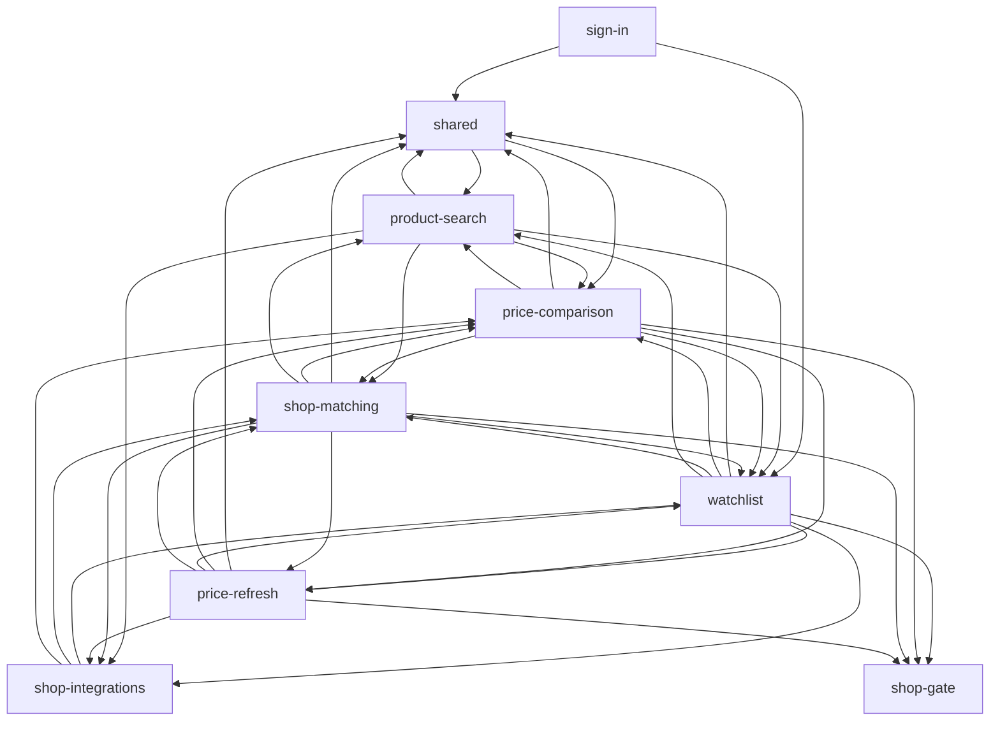
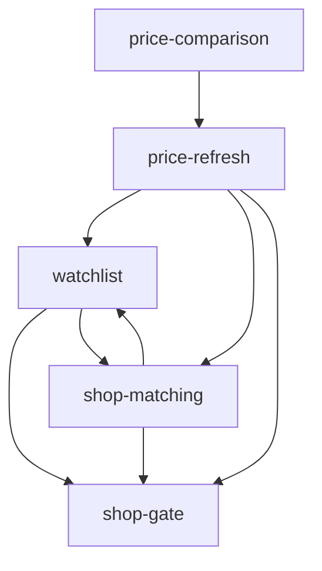

# Evidence: structure

Static dependency graph of HEAD f087611 (worktree, branch docs/m4-project-map), folded to capabilities with `capabilityOf` from `context/map/.work/attribute.mjs`. Raw output: `context/map/.work/` (edge CSVs, `structure-analysis*.txt`, `test-analysis.txt`, `gm-*.md`). Labels: **evidence** (a command in this session produced it), **inference** (a reading of evidence), **unknown** (a blind spot, never "no dependency").

## Graph sources

| Files                                                                            | Source                                                                                                                                                                                          | Level                 | Confidence       | Covers / blind spots                                                                                                                                                                                                                                                                            |
| -------------------------------------------------------------------------------- | ----------------------------------------------------------------------------------------------------------------------------------------------------------------------------------------------- | --------------------- | ---------------- | ----------------------------------------------------------------------------------------------------------------------------------------------------------------------------------------------------------------------------------------------------------------------------------------------- |
| `.ts`, `.tsx`, `.mjs`, `.js` (src, scripts, tests, root config, `.claude/hooks`) | TypeScript 6.0.3 compiler API from the worktree's `node_modules` (`ts.createSourceFile`, `ts.resolveModuleName` under the repo's `tsconfig.json`: `@/*` → `./src/*`, Bundler resolution)        | 2 (project toolchain) | high             | 193 code files parsed; 762 local import statements resolved, **0 unresolved**, 0 dynamic `import()`, 0 `import.meta.glob`, 0 re-exports; 196 package/builtin/virtual imports removed. `verbatimModuleSyntax: true` makes type-only imports exact syntax (97 `import type`, 0 inline-type-only). |
| `.astro` (33)                                                                    | `@astrojs/compiler` 2.13.1 `parse` (in project deps): frontmatter parsed as server code, non-inline `<script>` as client code, `client:*` directives read from the template; same TS resolution | 2                     | high for imports | 29 of 33 files have local imports; grep confirms the other 4 have none. Template props/slots are not edges. `is:inline` scripts hold no imports.                                                                                                                                                |
| SQL (8 migrations)                                                               | text extraction of `create table/view/function` and of statements naming another migration's object (`extract-db-graph.mjs`)                                                                    | 4                     | medium           | 10 objects, 25 cross-migration statements, all listed in `.work/db-detail.tsv`; no SQL parser (function bodies are text).                                                                                                                                                                       |
| Code → database                                                                  | `.from("…")`, `.rpc("…")` and quoted object names (a `TABLE` constant) in app code                                                                                                              | 4                     | medium           | 5 app files reach the database; table names built at runtime would be missed (none seen).                                                                                                                                                                                                       |
| Code → HTTP routes                                                               | `"/api/…"` strings (form `action`, route constants) mapped to `src/pages/api/**`                                                                                                                | 4                     | medium           | 13 edges; one doc-comment hit in `src/types.ts` dropped.                                                                                                                                                                                                                                        |

- Level 1 (evidence): no graph tooling in the repo (no dependency-cruiser, madge or skott in `package.json`, CI or config). There are two boundary rules in `eslint.config.js`, used below as the project's stated layering: `islandConfig` (30 browser-shipped files may not import zod, Supabase, `astro:*`, `@/lib/supabase` or `@/lib/services/*` at runtime, except `matching`, `price-comparison` and `watchlist-rows`; type imports allowed) and `serverFetchConfig` (no `fetch` in server code outside `src/lib/services/shop-gate.ts`).
- Level 3: dependency-cruiser, madge, skott and ast-grep are not installed (not on PATH; global npm holds only pnpm). Not needed, because level 2 worked. No temporary `npx` tool was run.
- Graph scopes. **app** = 103 files under `src/` minus tests, the test helpers (`src/lib/services/testing/`) and the dev kitchen sinks (`src/dev/`, story-like pages served only under `astro dev`). `edges-ts.csv` holds app edges as `runtime`/`type` plus tooling edges as `build`: 404 rows (333 runtime, 55 type, 16 build). Tests are in `edges-ts-tests.csv` (288 rows from 64 files) and kitchen sinks in `edges-ts-dev.csv` (66 rows).
- Attribution check (evidence): over all 587 tracked files, `graph-metrics.mjs`'s own folding of `capabilities.tsv` (first glob, `*` = `[^/]*`) and `capabilityOf` (longest glob, `*` = `.*`) disagree on **0** files. `--modules` uses `.work/file-capabilities.tsv`, one `capabilityOf` line per file. No app file is unmapped.

## Capability graph

Runtime edges between capabilities, app scope (evidence: `graph-metrics … --modules file-capabilities.tsv --kind runtime`). The graph has 9 nodes and **38 of 72 possible directed edges**. Ca/Ce count capabilities; the file-edge columns count distinct file pairs from `edges-ts.csv`.

| Capability        |             App files |  Ca |  Ce | Instability | Runtime file edges out / in | Type-only file edges out / in |
| ----------------- | --------------------: | --: | --: | ----------: | --------------------------: | ----------------------------: |
| watchlist         |                    14 |   6 |   7 |        0.54 |                     37 / 42 |                         3 / 4 |
| price-comparison  |                    13 |   6 |   6 |        0.50 |                     48 / 22 |                         5 / 4 |
| shop-matching     |                    10 |   5 |   7 |        0.58 |                     42 / 18 |                         8 / 0 |
| product-search    |                     4 |   4 |   5 |        0.56 |                      13 / 7 |                         2 / 0 |
| price-refresh     |                     7 |   3 |   6 |        0.67 |                      18 / 7 |                         6 / 2 |
| shop-integrations |                    11 |   4 |   3 |        0.43 |                      12 / 7 |                        17 / 0 |
| shop-gate         |                     2 |   4 |   0 |           0 |                       0 / 8 |                        2 / 10 |
| sign-in           |                    18 |   0 |   2 |           1 |                      30 / 0 |                         0 / 0 |
| shared (bucket)   | 25 incl. `global.css` |   6 |   2 |        0.25 |                      2 / 91 |                        2 / 25 |

Runtime file edges, row imports column (evidence, `.work/cap-matrix.md`): SI sign-in, PS product-search, WL watchlist, SM shop-matching, PC price-comparison, PR price-refresh, SH shop-integrations, SG shop-gate, SD shared.

| from \ to         |  PS |  WL |  SM |  PC |  PR |  SH |  SG |  SD |
| ----------------- | --: | --: | --: | --: | --: | --: | --: | --: |
| sign-in           |     |   8 |     |     |     |     |     |  22 |
| product-search    |   · |   3 |   1 |   2 |     |   2 |     |   5 |
| watchlist         |   4 |   · |   3 |   4 |   2 |   2 |   1 |  21 |
| shop-matching     |   1 |  10 |   · |  10 |   1 |   2 |   2 |  16 |
| price-comparison  |   1 |   9 |   9 |   · |   4 |     |   3 |  22 |
| price-refresh     |     |   5 |   1 |   4 |   · |   1 |   2 |   5 |
| shop-integrations |     |   7 |   4 |   1 |     |   · |     |     |
| shared            |   1 |     |     |   1 |     |     |     |   · |

No capability imports sign-in, and shop-gate imports nothing at runtime.

The database layer, as migration-to-migration references folded to capabilities (evidence: `graph-metrics edges-sql.csv --modules … --emit mermaid`; 5 nodes, 8 edges). It adds **no capability pair that the import graph lacks**, but it changes the weights (see Blast radius):

## Blast radius per capability

Runtime, app scope. A transitive dependent is any file outside the capability that reaches one of its files; there are 16 entry points (`src/pages/**` and `src/middleware.ts`). Source: `.work/structure-analysis.txt` (evidence).

| Capability (criticality) | Direct dependents: files / capabilities | Transitive dependents: files / capabilities | Entry points reached | Pulls in downstream: files / capabilities | Contracts other capabilities import (runtime)                                                                                                                                                                                                                                                                                                                                                                                               |
| ------------------------ | --------------------------------------- | ------------------------------------------- | -------------------: | ----------------------------------------- | ------------------------------------------------------------------------------------------------------------------------------------------------------------------------------------------------------------------------------------------------------------------------------------------------------------------------------------------------------------------------------------------------------------------------------------------- |
| price-comparison (high)  | 19 / 6                                  | 50 / 7                                      |                15/16 | 61 / 7                                    | `price-comparison.ts` (16 importers in 6 capabilities): `PRICED_SHOPS`, `SHOP_LABELS`, `matchedShopsOf`, `parseMatchedShop`, `keyText`; real rules only to `price-targets.ts`, `prices.ts` and `watchlist-rows.ts` (see Mechanical). Island pieces `ShopCard`/`ShopLink` (→ shop-matching's `MatchCard`, `MatchChoice`), `Price.tsx` and `PRICES_EVENT` (→ watchlist's `RowTag`), `REFRESH_FORM_ROUTE` (→ price-refresh's `RefreshForm`)    |
| shop-matching (high)     | 12 / 5                                  | 45 / 6                                      |                15/16 | 35 / 7                                    | `size.ts` (`parseSize`, `trailingSizeText`, `isSetName`: 4 adapters and `watchlist.ts`), `matches.ts` (`listMatchStates`, `listMatches`, `shopItemIdSchema`: both pages and `price-targets.ts`), `matching.ts` (`pickMatch`, `sharesAnEan` → `product-search.ts`; `matchDifferences` → `watchlist-rows.ts`), the `MatchCard`/`match-card.ts`/`MatchChoice` views, and `runMatchSteps`, `match-step.ts`, `match-view.ts` (only `[id].astro`) |
| watchlist (high)         | 27 / 6                                  | 41 / 6                                      |                15/16 | 45 / 7                                    | `watchlist-rows.ts` (21 importers in 6 capabilities: `rowProductOf` ×7, `filterHref` ×7, `ListFilter`, `parseListFilter`, `NEXT_PARAM`, `SIGN_IN_PATH`, `signInHref`), `watchlist.ts` (8: `parseWatchlistItemId` ×5, `getWatchlistProduct`, `listWatchlist`, `productFullName`), `product-limits.ts` (7: `PRODUCT_LIMITS` ×6, `PRICE_LIMITS`), 4 list components used by `[id].astro`                                                       |
| shop-integrations (high) | 6 / 4                                   | 28 / 6                                      |                15/16 | 5 / 3                                     | `shops/registry.ts` `SHOP_ADAPTERS` (6 importers: `watchlist.ts`, `form-fields.ts`, `matches.ts`, `shop-matching.ts`, `price-refresh.ts`, `product-search.ts`); `rossmann.ts` `searchRossmann` → `product-search.ts`                                                                                                                                                                                                                        |
| price-refresh (high)     | 5 / 3                                   | 6 / 3                                       |                 4/16 | 27 / 6                                    | `prices.ts` (`listLatestPrices` for both pages, `recordPriceChecks` for `shop-matching.ts`, `productPricesOf`), `parsePriceRefreshCode` (both pages), and the `RefreshBar`/`RefreshForm` views in the island; over HTTP it serves `/api/watchlist/prices` (island) and `/api/watchlist/refresh` (list head, island)                                                                                                                         |
| product-search (high)    | 4 / 4                                   | 5 / 4                                       |                 2/16 | 27 / 6                                    | `search-query.ts` (`toShopQuery` → `shop-matching.ts`, `searchStepOf` → `watchlist.astro`, `isOwnNavigation` → `[id].astro`), `SearchForm.astro` (shell header, list page), `SearchResults.astro`, `searchShops`/`searchResultsOf`                                                                                                                                                                                                          |
| shop-gate (high)         | 8 / 4                                   | 19 / 5                                      |                 4/16 | 0 / 0                                     | `shopGateFor` (imported at runtime only by the 4 entry points that build a gate), the `ShopGate` type (10 service and adapter files; DI), `shop-messages.ts` texts (4 files in price-comparison and shop-matching)                                                                                                                                                                                                                          |
| sign-in (high)           | 0 / 0                                   | 0 / 0                                       |       9/16 (its own) | 33 / 5                                    | none imported by others; it depends on watchlist's `watchlist-rows.ts` and `watchlist.ts` (8 edges) and shared (22)                                                                                                                                                                                                                                                                                                                         |
| shared (medium)          | 42 / 6                                  | 55 / 6                                      |                15/16 | 2 / 2                                     | `cn` (19 importers in other capabilities), `notices.ts` (14), `button` (13), `alert` (11), `SubmitOnce` (7), `card`, `badge`, `ProductThumb` (4 each), `types.ts` (`SHOP_IDS` at runtime ×3; 25 type-only importers)                                                                                                                                                                                                                        |
| platform (high, tooling) | —                                       | —                                           |                    — | —                                         | No app code. Tooling graph: 13 nodes, 16 build edges, 0 cycles. Hubs: `scripts/e2e-local-db.mjs` (4 check scripts, plus 9 e2e-harness importers in test scope) and `scripts/hosted-env.mjs` (the deploy gate chain `wait-for-deploy-check → deploy-checked → check-migrations-applied / check-production`, plus sign-in's `owner-link.mjs`)                                                                                                 |

Database reach that the import graph doesn't show (evidence: `.work/db-detail.tsv`):

- **One data-access module per table.** `watchlist.ts` → `watchlist_items`; `matches.ts` → `watchlist_matches`; `prices.ts` → `price_observations`, `latest_price_observations` and `price_summaries`; `shop-gate.ts` → `reserve_shop_request` and `report_shop_block`. `src/lib/supabase.ts` is the only runtime `@supabase/*` import in production code.
- **shop-gate's `shops` table is the foreign-key target of all three user tables** (`watchlist_items`, `watchlist_matches`, `price_observations`; SQL Ca 3). A change to a shop id reaches every data capability through the schema.
- **price-refresh's migration reaches into two other capabilities' tables** (`20260928011450_price_observations.sql`). Its RLS policies `price_observations_select_watched` and `…_insert_watched` read `watchlist_items` and `watchlist_matches`, so who may read and add shared prices (FR-005) is defined over watchlist's and shop-matching's tables. The same file alters both tables' constraints, revokes and re-grants the update columns of `watchlist_matches`, and creates an index on it.
- **price-comparison's migration** (`price_history.sql`) defines the view `price_summaries` over price-refresh's `price_observations` and `latest_price_observations`, and price-refresh's `prices.ts` reads it.

## Cycles

- **File level, runtime: 0 cycles** (102 nodes, 333 edges). Evidence.
- **File level, all kinds: 1 component of 3 files** (`src/lib/notices.ts`, `src/lib/services/price-refresh.ts`, `src/lib/services/watchlist.ts`). The smallest real loop is 2 files: `price-refresh.ts → notices.ts` at runtime (`LIST_PRICES_PARAM`, `PRICES_PARAM`), closed only by `notices.ts → price-refresh.ts` `import type { PriceRefreshCode }`. Type-closed, so it is listed under Mechanical. Evidence.
- **Capability level, runtime: 1 strongly connected component of 7 capabilities** (all but sign-in and shop-gate), made of 13 bidirectional pairs. **None is a file loop**: each direction is carried by different files. The smallest loops are 1 + 1 file edges, both service to service (evidence):
  - **price-refresh ⇄ shop-matching:** `price-targets.ts → matches.ts` {`listMatches`, `listMatchStates`, `shopItemIdSchema`} and `shop-matching.ts → prices.ts` {`recordPriceChecks`};
  - **product-search ⇄ shop-matching:** `product-search.ts → matching.ts` {`pickMatch`, `sharesAnEan`} and `shop-matching.ts → search-query.ts` {`toShopQuery`}.
- **What-if folds** (inference; `gm-cap-runtime-whatif*.md`). Folding 6 leaf rule/contract files into one node (`watchlist-rows.ts`, `product-limits.ts`, `price-comparison.ts`, `matching.ts`, `size.ts`, `search-query.ts`; their only runtime fan-out is `watchlist-rows.ts → matching.ts, price-comparison.ts`) and the 16 entry points into another leaves a 6-capability component with only **4** two-way pairs:
  - price-comparison ⇄ price-refresh, from the island's own views: `PriceComparisonView → RefreshBar`, `ProductTitle → RefreshForm` and back `RefreshForm → price-comparison-state.ts` {`REFRESH_FORM_ROUTE`};
  - price-comparison ⇄ shop-matching, from the island's views: `PriceComparisonView → MatchCard`/`match-card.ts` and back `MatchCard → ShopCard`/`ShopLink`;
  - product-search ⇄ shared, from the shell: `AppHeader.astro → SearchForm.astro`;
  - price-refresh ⇄ shop-matching, from the services (above).

  So 9 of the 13 loops come from where the leaf rules and the composition-root pages are filed, 3 are view composition inside one island or shell, and 1 is a service-level dependency running both ways.

- **SQL: shop-matching ⇄ watchlist** at the capability level only. The schema points one way (`watchlist_matches` → `watchlist_items`, a composite foreign key); the back edge is `20261001182905_watchlist_removal_and_repin.sql`, filed under watchlist by `*watchlist_removal*`, creating `watchlist_matches`' update policy. This is a migration-attribution artefact (Mechanical).
- Tooling (build) graph: 0 cycles. Evidence.

## Broken boundaries

Intended layering (inference, from the directories and the rules file's "Shared types in `src/types.ts` and business logic in `src/lib/services/`"): foundation (`src/types.ts`, `src/lib/*.ts`, `src/components/ui`, `src/styles`) → services (`src/lib/services/**`) → views (`src/components/**`, `src/layouts`) → entry points (`src/pages`, `src/middleware.ts`). Plus the two ESLint boundaries above.

What holds (evidence):

1. **Directory layering.** 1 upward runtime edge of 337 import statements: `src/lib/notices.ts` (foundation, shared) → `src/lib/services/price-comparison.ts` {`SHOP_LABELS`}, plus 1 upward type edge (`notices.ts → price-refresh.ts` {`PriceRefreshCode`}). No service imports a view, and no view imports an entry point.
2. **Island boundary, complete.** The runtime closure of the 4 browser roots (`PriceComparison.tsx` via `client:load`, `RowTag.tsx` via `client:media`, `notices.ts` and `theme.ts` via `<script>`) is **30 files, exactly `islandConfig`'s 30**: none unguarded, none extra, 0 runtime edges into server-only modules. 3 type-only edges into server-only modules are allowed by `allowTypeImports` (`MatchCard.tsx` and `match-card.ts` → `match-view.ts` types; `notices.ts` → `PriceRefreshCode`). The list is kept by hand ("a module an island starts to import joins `files`"); it is complete at HEAD.
3. **Shop access.** `shop-gate.ts` is imported at runtime only by the 4 entry points that build a gate (`/api/watchlist/prices`, `/api/watchlist/refresh`, `watchlist.astro`, `[id].astro`); services and adapters receive it as the `ShopGate` type.

What's broken, at the capability level (edges are evidence; "against the layering" is inference):

4. **Foundation-like contracts filed inside feature capabilities.** `watchlist-rows.ts` (watchlist) is imported by 21 files in 6 other capabilities: the sign-in middleware and `return-path.ts` take `SIGN_IN_PATH`, `NEXT_PARAM` and `signInHref`, and the Rossmann adapter takes `rowProductOf`. Others: `product-limits.ts` (watchlist; 7 importers in shop-integrations and shop-matching); `size.ts` (shop-matching; 4 adapters and `watchlist.ts`); `search-query.ts` (product-search; `toShopQuery` for shop-matching); and the shop registry inside `price-comparison.ts`. These carry 9 of the 13 capability loops (what-if above).
5. **The integration layer imports features.** shop-integrations → watchlist (7 edges: six adapters' `PRODUCT_LIMITS`/`PRICE_LIMITS`, `rossmann.ts → watchlist-rows.ts` {`rowProductOf`}), → shop-matching (4 × `size.ts`), → price-comparison (`super-pharm.ts` {`polishDate`}).
6. **Sign-in's return path drags in the shop adapters.** `return-path.ts → watchlist.ts` {`parseWatchlistItemId`} → `shops/registry.ts` → every adapter. The middleware's runtime closure is therefore 23 files in 6 capabilities, and each auth API route reaches 22 files including shop-integrations.
7. **Shared depends on features.** `notices.ts → price-comparison.ts` {`SHOP_LABELS`} at runtime; the shell's `AppHeader.astro → SearchForm.astro` (product-search); and over HTTP only, the shell's `AccountMenu`/`AppHeader` sign-out forms post to sign-in's `/api/auth/signout`.
8. **Composition-root pages filed under one capability.** `src/pages/watchlist/[id].astro` (price-comparison) imports 26 files from 7 capabilities directly and reaches 73 of the 102 graph nodes. It calls `runMatchSteps`, `listMatches`/`listMatchStates`, `listLatestPrices`/`productPricesOf`, `shopGateFor`, the watchlist reads and the notices. `src/pages/watchlist.astro` (watchlist) imports 17 files from 6 capabilities and reaches 55. This orchestration lives in page frontmatter, not in a service.
9. **Database DDL across capability lines** (see Blast radius). price-refresh's migration alters watchlist's and shop-matching's tables and defines its RLS over them; watchlist's removal migration writes shop-matching's update policy. Guard (evidence: `.github/workflows/ci.yml` lines 52–102 run them; the rules file places them in CI's `smoke` job): `check-prices-db.mjs` (reads `watchlist_matches` 9×, `watchlist_items` 4×, `price_summaries` 1×), `check-matches-db.mjs`, `check-watchlist-db.mjs`, `check-catalog-db.mjs`, `check-two-users.mjs` and `npm run test:db`. So this is a corridor guarded by checks (false-signal rule 3), not a hidden contract.

## Test risks

Evidence from `edges-ts-tests.csv` and `.work/test-analysis.txt`. "Modules" counts production files a test imports, without the fixtures or the test helpers. Every shop path in the unit tests runs through the **real gate** (`createShopGate`) with **recorded answers** (`createReplayFetch`, 95 fixture imports across 10 tests). Supabase is injected: only `src/lib/supabase.ts` imports it at runtime, and services take the `SupabaseClient` type. **2 of 16 entry points are imported by any unit test** (`price-routes.test.ts` imports `/api/watchlist/prices` and `/api/watchlist/refresh`).

| Capability        | Unit tests | DB / contract                                            |        E2E specs | Where isolation gets hard (inference from the edges)                                                                                                                                                                                            |
| ----------------- | ---------: | -------------------------------------------------------- | ---------------: | ----------------------------------------------------------------------------------------------------------------------------------------------------------------------------------------------------------------------------------------------- |
| price-comparison  |          3 | —                                                        |                5 | `[id].astro` (Ce 26, reaches 73 files) has no unit test, so it is covered by e2e only; `price-pages.test.ts` imports 9 modules (7 from 4 other capabilities) with `stubSupabase` and the real `shopGateFor`, which makes it an integration test |
| shop-matching     |          7 | 1 db-unit (`matches.db.test.ts`), `check-matches-db.mjs` |                1 | `shop-matching.test.ts` and `matches.test.ts` need the real gate, the replayed shops and the adapter registry (4 and 6 modules), which is integration style; its RLS rules need a local Supabase                                                |
| watchlist         |          2 | `check-watchlist-db.mjs`                                 |                1 | `watchlist.ts` pulls in the adapter registry, so `watchlist.test.ts` runs the gate with replay (5 modules); `watchlist.astro` (Ce 17) is covered by e2e only                                                                                    |
| price-refresh     |          4 | `check-prices-db.mjs`                                    |                2 | `price-refresh.test.ts` imports 8 modules, 7 of them from 4 other capabilities; it is the only capability whose routes are unit-tested; its RLS depends on two other capabilities' tables, so it needs DB checks                                |
| product-search    |          2 | —                                                        |                0 | `product-search.test.ts` (gate + replay, 3 modules); no e2e spec is attributed to it                                                                                                                                                            |
| shop-integrations |          8 | —                                                        |                0 | adapters are tested through the gate with fixtures; `luigis-box.ts`, `pinned-prices.ts` and `shop-values.ts` are not imported by any test directly, only through the adapters (inference)                                                       |
| shop-gate         |          2 | `check-shop-gate-db.mjs`                                 |                0 | a leaf (Ce 0), the easiest to isolate; its RPCs need a local Supabase                                                                                                                                                                           |
| sign-in           |          3 | `smoke.mjs` (HTTP)                                       | via `auth.setup` | the middleware and 8 auth entry points have no unit test; the middleware needs `astro:middleware` and a Supabase client, so it is covered by smoke and e2e only                                                                                 |
| shared            |          4 | —                                                        |                — | `config-status.ts`, `supabase.ts` and `theme.ts` are imported by no test (they hold global env and the client factory)                                                                                                                          |

## Centres and thin entry points

Centres: file level, runtime, app scope (evidence; Ca and Ce count files).

| File                                   | Capability        |           Ca |  Ce | Instability | What others take, and the signal type                                                                                                                                                                                                            |
| -------------------------------------- | ----------------- | -----------: | --: | ----------: | ------------------------------------------------------------------------------------------------------------------------------------------------------------------------------------------------------------------------------------------------ |
| `src/lib/utils.ts`                     | shared            |           29 |   0 |           0 | `cn` only: utility fan-in by design (mechanical)                                                                                                                                                                                                 |
| `src/lib/services/watchlist-rows.ts`   | watchlist         |           29 |   2 |        0.06 | URL and route contract (`SIGN_IN_PATH`, `NEXT_PARAM`, `signInHref`, `filterHref`, `parseListFilter`) plus row rules (`rowProductOf`, `rowTagOf`, `listRowsOf`). This is the **load-bearing contract**, browser-safe, filed in a feature          |
| `src/lib/services/price-comparison.ts` | price-comparison  |           23 |   0 |           0 | Mostly the shop registry: of 19 importers in other capabilities (runtime + type), 12 take registry symbols only and 4 add formatting helpers. Real rule consumers: `price-targets.ts`, `prices.ts`, `watchlist-rows.ts`. Config-as-code (rule 2) |
| `src/components/ui/button.tsx`         | shared            |           17 |   1 |        0.06 | design system                                                                                                                                                                                                                                    |
| `src/lib/notices.ts`                   | shared            |           14 |   1 |        0.07 | notice codes, parameters and texts (a table, config-as-code)                                                                                                                                                                                     |
| `src/lib/services/watchlist.ts`        | watchlist         |           11 |   8 |        0.42 | Hub: sole owner of `watchlist_items`. `parseWatchlistItemId` is used by 5 files in 4 capabilities (sign-in, price-refresh, shop-matching, price-comparison); the file also depends on the adapter registry                                       |
| `src/lib/services/product-limits.ts`   | watchlist         |            8 |   0 |           0 | limits that mirror the SQL check constraints                                                                                                                                                                                                     |
| `src/lib/services/size.ts`             | shop-matching     |            7 |   0 |           0 | size parsing for 4 adapters and the watchlist                                                                                                                                                                                                    |
| `src/lib/services/shops/registry.ts`   | shop-integrations |            6 |   4 |        0.40 | `SHOP_ADAPTERS`, a registry (config-as-code)                                                                                                                                                                                                     |
| `src/lib/services/shop-gate.ts`        | shop-gate         | 4 (+10 type) |   0 |           0 | the `ShopGate` DI contract; true runtime reach is unknown (see Unknowns)                                                                                                                                                                         |

Entry points (evidence; Astro wires them by file convention, so Ca is 0 by construction):

| Entry point                                 | Capability       | Direct Ce | Direct capabilities | Transitive files | Reading (inference)                                       |
| ------------------------------------------- | ---------------- | --------: | ------------------: | ---------------: | --------------------------------------------------------- |
| `src/pages/watchlist/[id].astro`            | price-comparison |        26 |                   7 |               73 | **thick**: the product page is the app's composition root |
| `src/pages/watchlist.astro`                 | watchlist        |        17 |                   6 |               55 | **thick**: list, search and refresh orchestration         |
| `src/pages/api/watchlist/refresh.ts`        | price-refresh    |         5 |                   3 |               25 | thin, delegates                                           |
| `src/pages/api/watchlist/prices.ts`         | price-refresh    |         4 |                   3 |               26 | thin                                                      |
| `src/pages/api/watchlist/matches.ts`        | shop-matching    |         4 |                   3 |               21 | thin                                                      |
| `src/middleware.ts`                         | sign-in          |         4 |                   3 |               23 | thin, but its closure includes the shop adapters          |
| `src/pages/auth/*.astro` (3)                | sign-in          |       3–5 |                 1–3 |            36–38 | thin                                                      |
| `src/pages/api/auth/*.ts` (4)               | sign-in          |       1–3 |                 1–2 |               22 | thin (→ `auth.ts`)                                        |
| `src/pages/api/watchlist.ts`, `…/remove.ts` | watchlist        |         2 |                 1–2 |               20 | thin                                                      |
| `src/pages/index.astro`                     | sign-in          |         0 |                   0 |                0 | redirect only                                             |

## Mechanical signals

Kept out of the risk ranking, with the reason (evidence for the counts):

- **Type-only edges (rule 9): 55 app rows.** Of these, 45 cross capabilities and 25 point at `src/types.ts`. Some capability pairs exist only as types: shop-integrations → shared (9, `types.ts`), shop-integrations → shop-gate (7, `ShopGate`), shop-gate → shared (2), product-search → shop-gate (1), shared → price-refresh (1). The type-only capability graph has a 5-node component (price-comparison, price-refresh, shared, shop-gate, watchlist), and the only all-kinds file cycle is type-closed (Cycles).
- **Build and tooling edges (rule 1): 16** (scripts → scripts), 0 into `dist/`, 0 from tooling into `src/`. Test scope adds 9 e2e-harness edges into `scripts/e2e-local-db.mjs` and 7 script-test edges.
- **Config-as-code fan-in (rule 2).** The shop registry in `price-comparison.ts` (12 registry-only and 4 registry-plus-helpers of 19 cross-capability importers); `SHOP_ADAPTERS` (6); `notices.ts` codes (14); the middleware's `PROTECTED_ROUTES` prefix list. They are guarded by the shop-union types (`MatchableShop`, `PricedShop`) and `astro check` in CI.
- **Utility and design-system fan-in:** `cn` (19 importers in other capabilities), `button` (13), `alert` (11).
- **Dev kitchen sinks:** 66 edges from 5 `src/dev` files (to shared 23, watchlist 13, price-comparison 11, shop-matching 8, sign-in 6, product-search 3, shop-gate 1, price-refresh 1), excluded from the runtime graph. No file is imported only by them.
- **Attribution artefacts:** the SQL shop-matching ⇄ watchlist loop (one migration file for removal and re-pin), and 9 of the 13 capability loops (leaf rules and composition-root pages filed under feature capabilities).
- **Duplicate statements:** pages that import `notices.ts` in both frontmatter and `<script>` count once in the CSVs.

## Unknowns

- **Runtime coupling the static graph can't see.**
  - The gate is injected: 10 files hold only the `ShopGate` type, so every adapter call path depends on `shop-gate.ts` at runtime while showing a type edge. Its static runtime reach (4 entry points) understates it.
  - The Supabase client travels through `Astro.locals` (the middleware creates it), so `src/lib/supabase.ts` shows Ca 1 while every database read depends on it.
  - Astro wires `src/pages/**` and `src/middleware.ts` by file convention.
  - Configuration arrives through `astro:env/server` (2 files; its schema is in `astro.config.mjs`), `astro:middleware` and `astro:assets`.
  - Window events link the islands: `PRICES_EVENT` (island → `RowTag`) and `THEME_CHANGE_EVENT` (inline head script → `ThemeToggle`). Only their constants are imports.
  - None found: dynamic imports, codegen markers, queues, webhooks, feature flags in code.
- **HTTP coupling (level 4):** 13 view → route edges; one capability pair exists only over HTTP (shared → sign-in, the sign-out forms).
- **Database (level 4, regex):** RLS bodies, foreign keys and grants were read as text with no SQL parser; plpgsql bodies are not analysed beyond object names.
- **`product-limits.ts` ⇄ SQL check constraints:** the rules file says they move together. No check compares them (`check-prices-db.mjs` asserts the bounds with literal values and imports nothing from `src`), so it is unknown whether a drift would fail loudly.
- **Not graphed:** CSS `@import`/Tailwind sources (`global.css` is a single node), `.github` YAML, `.husky`, JSON/JSONC config (`wrangler.jsonc`, `components.json`), Astro template props and slots, and the e2e harness's Docker and database side effects.
- **External consumers:** none visible. The app publishes no package or API beyond its own routes; Cloudflare Workers Builds calls `deploy:checked` from outside the repo, which is unknown (external).
- **Tools worth installing:** dependency-cruiser could turn the island boundary and the layering into CI-checked rules (`tsPreCompilationDeps` keeps type-only edges apart), but it can't read `.astro` frontmatter without a pre-step, so the level-2 extractor in `.work/` (TypeScript API + `@astrojs/compiler`) would remain the source for `.astro`. A real SQL parser (libpg_query bindings) would replace the migration regex.

## Commands run

- `git -c core.quotepath=off ls-files` (inside every extractor); `command -v depcruise madge skott ast-grep sg rg`; `npm ls -g --depth=0`.
- `node context/map/.work/extract-ts-graph.mjs` (TypeScript 6.0.3 API and `@astrojs/compiler` 2.13.1 from `node_modules`) → `edges-ts*.csv`, `edges-ts-detail.tsv`, `islands.tsv`, `ts-*.tsv`.
- `node context/map/.work/file-capabilities.mjs` (`capabilityOf` → `file-capabilities.tsv`; 0 folding disagreements over 587 files).
- `node .claude/skills/10x-repo-map/scripts/graph-metrics.mjs context/map/.work/edges-ts.csv --modules context/map/.work/file-capabilities.tsv --kind runtime|type|build [--unmapped group --emit mermaid]`, and at file level with `--kind runtime|all|type|build`.
- `node context/map/.work/analyse-structure.mjs`, `analyse-structure-2.mjs`, `analyse-tests.mjs`; the what-if folds through `graph-metrics … --modules file-capabilities-whatif.tsv` / `…-whatif2.tsv`.
- `node context/map/.work/extract-db-graph.mjs`, then `graph-metrics … edges-sql.csv --modules … --kind runtime [--emit mermaid]`; `node context/map/.work/extract-http-graph.mjs`.
- Confirmations with `grep`/`rg`: `islandConfig`/`serverFetchConfig` in `eslint.config.js`; `.from(`/`.rpc(` and table-name literals in `src`; `/api/` strings; `PRODUCT_LIMITS` references; the check steps in `.github/workflows/ci.yml`; `src/types.ts:268` (a doc comment).
