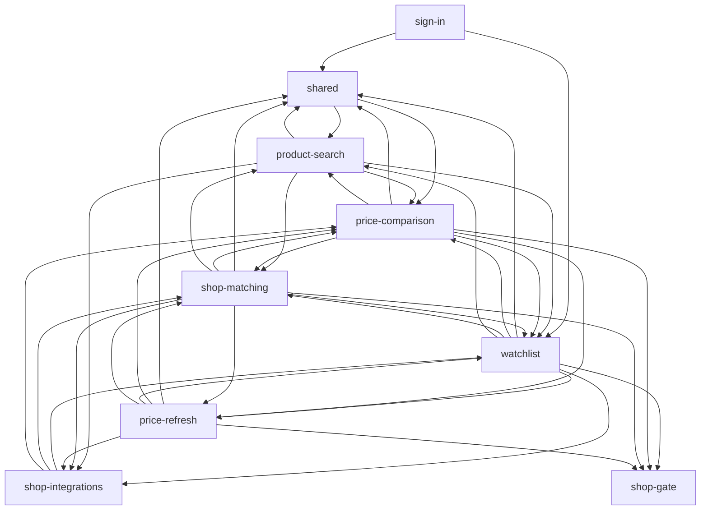

# Project map: Drogeria Radar

## TL;DR

Drogeria Radar is a private, invite-only web app that tells a shopper which of four Polish drugstores (Rossmann, Natura, Hebe, Super-Pharm) sells a product on their watchlist cheapest today, and whether today's price is a good one. Its eight business capabilities (sign-in, product search, the watchlist, shop matching, price comparison, price refresh, the shop adapters and the shop gate) were all built in three weeks by one person co-writing with an AI agent, change by change, each through a plan, phase commits and a review. The buzz sits in three places: **shop matching** (the most planned, reviewed and revised rule set), **the shop adapters** (the only rising capability, and the only one with defects found in merged code), and **the product page** (`src/pages/watchlist/[id].astro`, the most-changed code file and the app's composition root). The recurring pain is one defect class, an unreadable shop answer stored or shown as a fact, which came back after a written lesson and five more times in the adapters. Structurally there are no file-level cycles and the browser boundary holds exactly, but several shared contracts are filed inside feature capabilities, so seven capabilities form one loop on paper, and the sign-in middleware's imports reach every shop adapter.

Runtime dependencies between capabilities (from the structure evidence's capability graph, `evidence/3-structure.md:51-100`):

## Terrain

Buzz per family is high, medium or low relative to the other capabilities. Change and fix come from history, friction and attention from the discussion evidence, and reach from structure.

| Capability        | What it does                                                                                         | Criticality                                        | Change                              | Fix                       | Friction                            | Attention                        | Reach                                      | Trend              | Where it lives                                                                                                          |
| ----------------- | ---------------------------------------------------------------------------------------------------- | -------------------------------------------------- | ----------------------------------- | ------------------------- | ----------------------------------- | -------------------------------- | ------------------------------------------ | ------------------ | ----------------------------------------------------------------------------------------------------------------------- |
| shop-matching     | Looks a product up in its matched shops, accepts by EAN or by name, stores and re-pins decisions     | high: user decisions; matches decide what compares | high (159 changes, 38 commits)      | medium (4 about it)       | **high**: decision churn            | **high**: 5 changes, 63 findings | high: 45 files, 6 capabilities             | fading after W40   | `src/lib/services/{matching,shop-matching,matches,match-step,match-view,size}.ts`, `MatchCard.tsx`, `MatchChoice.astro` |
| price-comparison  | The product page: prices side by side, the cheapest marked, the verdict and the good-price judgement | high: core value                                   | **high** (215 changes, most of all) | medium (5)                | medium: 3 stale-page warnings       | high: 4 changes, 39 findings     | **high**: the composition root             | constant           | `src/pages/watchlist/[id].astro`, `price-comparison.ts`, the island under `src/components/watchlist/`                   |
| shop-integrations | Reads each shop's search and price answers                                                           | high: external integrations everything depends on  | high, **rising** (W41 2.3×)         | **high**: 7 about it, 26% | high: one defect class              | high: most research              | high: 28 files, 15 of 16 entry points      | rising             | `src/lib/services/shops/`                                                                                               |
| watchlist         | Adds, lists and removes the user's products                                                          | high: user data, privacy                           | medium (132)                        | low (2)                   | medium: the one production incident | medium                           | **high**: `watchlist-rows.ts`              | W40 spike          | `src/pages/watchlist.astro`, `src/lib/services/watchlist.ts`, `watchlist-rows.ts`                                       |
| price-refresh     | Refetches stale prices through the gate and appends shared observations                              | high: shared data written                          | medium (105)                        | low (3)                   | **high**: deferred twice            | medium                           | medium: 6 files, plus the database         | constant           | `src/lib/services/{price-refresh,prices,price-targets}.ts`, `src/pages/api/watchlist/{prices,refresh}.ts`               |
| sign-in           | Invite-only accounts, password sign-in, links, route protection                                      | high: identity, public entry points                | low (67)                            | low (spillover)           | low                                 | low (but 7 open audit findings)  | low: nothing imports it                    | fading             | `src/middleware.ts`, `src/pages/auth/`, `src/pages/api/auth/`, `src/lib/services/auth.ts`                               |
| product-search    | Searches four shops and groups items into one entry per product                                      | high: user text reaches four shops                 | low (25; new on 10-09)              | low                       | low                                 | medium: 7 accepted edges         | low                                        | constant           | `src/lib/services/product-search.ts`, `search-query.ts`, `SearchResults.astro`                                          |
| shop-gate         | One gate for every shop request: cap, pause, stop                                                    | high: the deployment's standing with each shop     | low (19)                            | low                       | low                                 | low                              | medium; runtime reach `unknown` (injected) | rising, low volume | `src/lib/services/shop-gate.ts`, its migration                                                                          |

- **Platform & infrastructure** (bucket, 119 changes): CI (`.github/workflows/ci.yml`, 17 commits), the checked deploy and its migration gate, the Playwright harness and the database checks. It caused the one production incident's fix, and its deploy-checks change is the only one never reviewed.
- **Shared foundations** (bucket, 107 changes): the design system, shell, tokens and `src/types.ts`. Its W40 spike is the redesign campaign.
- **Docs & planning** (bucket, 504 changes, 32% of all): plans, reviews and the rules file `CLAUDE.md`, the most-changed file (47 commits), which names 129 of the 172 current non-test files. It is the system of record, not a hot area.
- **Coverage:** 1563 counted file changes in 177 commits. Unmapped: 5 (0.3%, the starter's deleted demo pages). Of the 1059 code changes, the platform and shared buckets hold 21.3%.

Where folders don't match capabilities:

- **One folder, many capabilities.**
  - `src/components/watchlist/` holds components of five capabilities.
  - `src/lib/services/` is one flat folder for eight.
- **Shared contracts filed inside features** (`evidence/3-structure.md:174`):
  - `watchlist-rows.ts` (watchlist) carries sign-in's route contract and the row rules six capabilities use.
  - `price-comparison.ts` carries the shop list every capability reads.
  - `size.ts` (shop-matching) and `product-limits.ts` (watchlist) are used by the adapters.
- **One page, many capabilities.** `[id].astro` orchestrates seven capabilities from a page filed under one.

## Real couplings

| Coupling                                                                                                                                                   | How we know                                                           | Mechanical?                                                |
| ---------------------------------------------------------------------------------------------------------------------------------------------------------- | --------------------------------------------------------------------- | ---------------------------------------------------------- |
| The product page `[id].astro` → 7 capabilities (26 direct imports, 73 of 102 files reached): match steps, decisions, prices, the gate, the watchlist reads | runtime graph (`evidence/3-structure.md:178,218`)                     | no: orchestration in page frontmatter, not a service       |
| `watchlist-rows.ts` → imported by 21 files in 6 capabilities, the sign-in middleware and the Rossmann adapter among them                                   | runtime graph (`3-structure.md:174,204`)                              | no: a load-bearing contract filed in a feature             |
| sign-in → `return-path.ts` → `watchlist.ts` → the shop registry → every adapter (the middleware's closure: 23 files, 6 capabilities)                       | runtime graph (`3-structure.md:176`)                                  | no: a boundary break                                       |
| The adapters → `product-limits.ts`, `size.ts`, `rowProductOf`, `polishDate` (the integration layer imports features)                                       | runtime graph (`3-structure.md:175`)                                  | no                                                         |
| price-refresh ⇄ shop-matching: `price-targets.ts` → `matches.ts`, `shop-matching.ts` → `prices.ts` (the only service-level two-way pair)                   | runtime graph (`3-structure.md:149-151`)                              | no                                                         |
| price-comparison + price-refresh (13, 65%), + shared (12, 67%), + watchlist (8, 53%)                                                                       | co-change (`evidence/1-history.md:116-118`)                           | partly: the product page composes them                     |
| shop-integrations + shop-matching + price-refresh (+ shop-gate): each new shop touched all three                                                           | co-change (`1-history.md:119-131`)                                    | no: a real corridor                                        |
| `price_observations`' RLS is defined over `watchlist_items` and `watchlist_matches`; `shops` is the foreign-key target of all three user tables            | SQL text (`3-structure.md:140-143`)                                   | guarded corridor: CI's database checks run on every PR     |
| `PRODUCT_LIMITS` ↔ the SQL check constraints; migrations ↔ hand-kept `src/types.ts`                                                                        | rules file only; co-change 2 of 4 and 2 of 8 (`1-history.md:177-178`) | `unknown`: no check compares them                          |
| `islandConfig` ↔ the modules islands import                                                                                                                | lint config; exact at HEAD (`3-structure.md:169`)                     | guarded by lint only for listed files; hand-kept           |
| The island → the selected row's `RowTag` through `PRICES_EVENT` (a window event)                                                                           | constants only (`3-structure.md:248`)                                 | `unknown` to the graph                                     |
| `price-comparison.ts` fan-in (16 of 19 importers take only the shop list), `notices.ts`, `SHOP_ADAPTERS`, `cn`                                             | runtime graph                                                         | yes: config written as code                                |
| `notices.ts` ⇄ `price-refresh.ts`; the SQL watchlist ⇄ shop-matching loop                                                                                  | graph                                                                 | yes: type-only, and a migration filed under one capability |

## Risk zones

### 1. Shop matching: the rule and its decisions

- **Why:** the matching rule decides which item's price a product is compared against, and it is the most revised rule set in the app. A wrong silent match puts a wrong price on the page with no flag.
- **Independent signals:**
  - **Friction:** decision churn.
    - FR-006 and FR-007 hold 10 of the PRD's 20 dated updates.
    - S-06 put an automatic Super-Pharm match out of scope, and the next day's update reversed it.
    - Match-by-name's high-impact F1 could show a wrong item's price unflagged.
    - Two of its follow-ups are still unchecked (`evidence/2-discussion.md:78-83`).
    - These reversals are not growth (`2-discussion.md:203`).
  - **Reach:** 45 files in 6 capabilities depend on it, and it reaches 15 of the 16 entry points (`3-structure.md:128`).
  - **Change and attention,** counted once because building Hebe, Super-Pharm and name matching explains both: 159 changes, 5 changes named for it, 63 findings (`1-history.md:14`; `2-discussion.md:22`).
- **Where it lives:** `src/lib/services/matching.ts`, `src/lib/services/shop-matching.ts`, `src/lib/services/matches.ts`, `src/lib/services/match-step.ts`, `src/lib/services/match-view.ts`, `src/lib/services/size.ts`.

### 2. The shop adapters: reading answers honestly

- **Why:** every price and every match starts as a shop's answer. One defect class keeps recurring: an answer that can't be read gets stored or shown as a fact ("missing", "not found", a price).
- **Independent signals:**
  - **Fix pressure and friction,** one cause counted once:
    - 3 review findings led to lesson 3 on 2026-09-29;
    - 9 more findings came after it;
    - then D1–D5, found in merged code by the contract tests and fixed in 4 commits (`2-discussion.md:67-77`; `1-history.md:81,92,106`).
  - **Change:** the only rising business capability (W41 at 2.3×) (`1-history.md:59`).
  - **Reach:** 28 dependent files, and 15 of the 16 entry points reach it through the registry (`3-structure.md:130`).
- **Where it lives:** `src/lib/services/shops/rossmann.ts`, `src/lib/services/shops/luigis-box.ts`, `src/lib/services/shops/natura.ts`, `src/lib/services/shops/hebe.ts`, `src/lib/services/shops/super-pharm.ts`, `src/lib/services/shops/pinned-prices.ts`, `src/lib/services/shops/registry.ts`.

### 3. The product page as composition root (price-comparison)

- **Why:** every feature lands in one page's frontmatter. It decides the match steps, reads decisions and prices, builds the gate and hands the island its state. It has no unit test, only e2e (`3-structure.md:187`).
- **Independent signals:**
  - **Change and reach:** the composition root explains both. It is the most-changed code file (23 commits) and reaches 73 of the 102 app files from 7 capabilities (`1-history.md:48`; `3-structure.md:178,218`). It is also named in 17 of the 130 review findings (`2-discussion.md:139`).
  - **Friction:** three warnings in three changes about stale or open pages showing wrong prices (`2-discussion.md:87-90`).
  - **Attention:** 4 changes, 39 findings (`2-discussion.md:23`). The W40 redesign explains part of it.
- **Where it lives:** `src/pages/watchlist/[id].astro`, `src/lib/services/price-comparison.ts`, `src/components/watchlist/price-comparison-state.ts`, `src/components/watchlist/PriceComparison.tsx`.

### Watch

- **price-refresh.** Its friction is high, from two deferrals:
  - the full-history read of `latest_price_observations`, found on every list view, deferred twice;
  - the failing-shop stall, which came back as a warning (`2-discussion.md:84-86`).

  Its other families are medium, and it holds the only service-level two-way dependency, with shop-matching.

- **watchlist.** `watchlist-rows.ts` is the load-bearing contract (29 importers), but no other family is high (`3-structure.md:204`).
- **sign-in.** It is quiet in git, but the observability audit holds 7 sign-in findings (3 critical or high), and no change folder takes them up. Its import closure also reaches every shop adapter (`2-discussion.md:174-180`; `3-structure.md:176`).

### Looks hot, is not

- **Docs churn** (32% of changes, 87–100% co-change with everything): each phase updates its plan.
- **Review-fix commits:** one per change. Their spread inflates small capabilities' fix shares, e.g. sign-in's 35% is all spillover.
- **Name-only fixes:** S-08's change id `fix-matches-and-watchlist` matches the fix heuristic but is a feature.
- **Test-file churn** in shop-gate, shop-matching and price-refresh (about half their changes): tests written with each phase.
- **The W40 redesign spike** in shared and watchlist.
- **`price-comparison.ts`'s fan-in:** the shop list, config written as code.
- **Agent co-authorship on 100% of commits**, and one person carrying every capability: both are the baseline.
- **PR sizes:** inflated by recorded fixtures.

## Whom to ask

There is one person: the owner, for every zone and every kind of change. The agent co-wrote the code, but its sessions are not in the repository (`evidence/4-people.md:79`). Read before asking:

- **Shop matching:** `context/archive/2026-10-06-match-by-name/` and `context/archive/2026-10-01-fix-matches-and-watchlist/`; PRs #7, #17, #23, #32 and #39.
- **Shop adapters:** `docs/research/polish-drugstore-price-apis.md`; `context/archive/2026-10-07-testing-shop-answer-contracts/`; PRs #23, #30, #42, #43 and #44.
- **The product page:** `context/archive/2026-09-28-cheapest-shop-today/` and `context/archive/2026-10-06-good-price-judgement/`; PRs #9, #13, #15 and #36.

Work in flight: PR #45, the review fixes for `add-from-other-shops`, touches `matching.ts`, `shop-matching.ts`, `rossmann.ts` and the product title (`4-people.md:91`).

## First day

1. `CLAUDE.md`: the rules file, the system of record for every capability (it names 129 of the 172 non-test files).
2. `src/pages/watchlist/[id].astro` → `src/lib/services/price-comparison.ts`: the product page and the comparison's rules.
3. `src/lib/services/shop-matching.ts` → `src/lib/services/matching.ts`: the lookups and the matching rule (`pickMatch`).
4. `src/lib/services/shops/registry.ts` → `src/lib/services/shops/rossmann.ts` and `src/lib/services/shop-gate.ts`: how a shop is asked, and the gate every request goes through.
5. `src/pages/watchlist.astro` → `src/lib/services/watchlist-rows.ts` and `src/lib/services/product-search.ts`: the list, its rows and the four-shop search.
6. `src/lib/services/price-refresh.ts` → `src/lib/services/prices.ts`: fetching, storing and reading prices.
7. `supabase/migrations/20260928011450_price_observations.sql`: who may read and add shared prices, defined over the other capabilities' tables.
8. `src/middleware.ts` → `src/lib/services/auth.ts`: route protection and sign-in.

## Limitations

- **Window:** the whole history is three weeks, in three ISO-week buckets, the last one partial, so every trend label is weak.
- **Sources:** git and the forge. The forge holds no review discussion (0 reviews, 0 comments, 0 issues). The discussion lives in in-repo reviews, which an agent ran and the owner triaged, so what they miss is `unknown`.
- **Graph coverage:**
  - TypeScript, TSX, JS and MJS through the TypeScript API, and Astro through its compiler: high.
  - SQL, code→database and code→HTTP edges: medium (text matching).
  - Not graphed: CSS, YAML, JSON config, Astro props and slots, window events, the Supabase client passed through `Astro.locals`, and the gate's injected reach.
- **Capability coverage:** unmapped is 0.3% of changes; the catch-alls hold 21.3% of code changes; docs are 32% of all changes.
- **People:** one human, so concentration is the baseline.
- **Agents:** all four evidence agents completed. The scan contract's "2 commits emptied by noise" was corrected to 1 (60103c2); no total changed.
- **Excluded:** open PR #45 is outside every total.
- **What this map does NOT say:** whether the code is correct, how it performs, or what production does. No error tracker exists, and Workers Logs weren't read.
- **Unknowns worth a focused investigation:**
  - production errors beyond the one recorded incident;
  - the full-history read of `latest_price_observations` at scale;
  - drift between `PRODUCT_LIMITS` and the SQL bounds, between migrations and the hand-kept `src/types.ts`, and between the shop research note and the adapters (2 of 23 adapter commits touched it);
  - the completeness of the kitchen sinks and of the hand-kept `islandConfig` list;
  - the gate's true runtime reach;
  - the deploy-checks change, archived without a review;
  - `lessons.md`, unchanged since 2026-09-29 while 11 reviews followed;
  - who maintains the app after the MVP.
- **Unknowns not carried, with the reason:**
  - line churn was not measured, since the contract counts files per commit;
  - drift between `notices.ts`' texts and the routes' codes is invisible by design (a code without a text shows nothing);
  - external consumers: none beyond Workers Builds calling `deploy:checked`;
  - who holds the production accounts, and the upstream authors of the starter, the shadcn registry and the course tooling, are outside the repository;
  - the evidence files recommend two tools (dependency-cruiser with an `.astro` pre-step, and an SQL parser), but neither was needed for this map.
